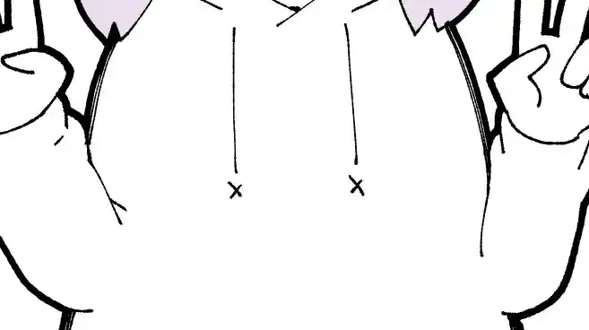

YouTube: https://youtu.be/OVuYIMa5XBw  
NekoCap: https://nekocap.com/view/Q5OOh2MlsX

Hardsub: https://youtu.be/qwCK0obJdyA

### Folder info

`akane-chan will listen.ass` is the base subtitle file. It does not contain any embedded fonts.  
`akane-chan will listen.assfonts.cleaned.export.ass` is the file submitted to nekocap. It contains embedded fonts.  
`wipe.aegs`:  
  
karaoke template code for this transition (use with [aegsc](https://github.com/butterfansubs/aegsc) and [The0x539's templater](https://github.com/The0x539/Aegisub-Scripts/blob/trunk/src/0x.KaraTemplater.moon))