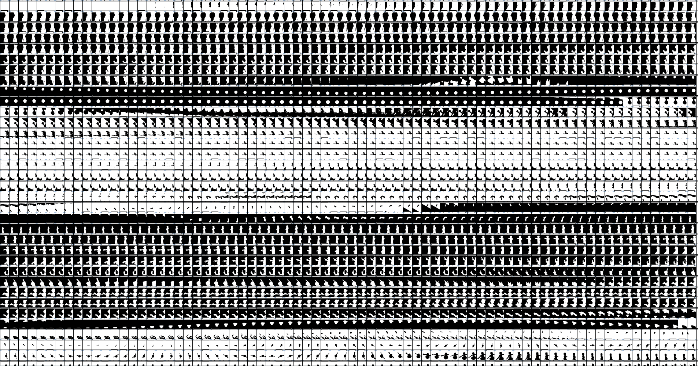
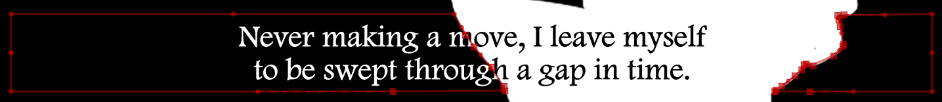
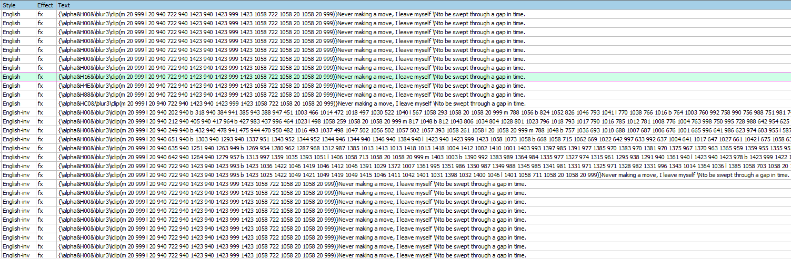
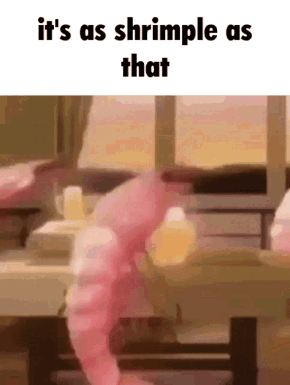
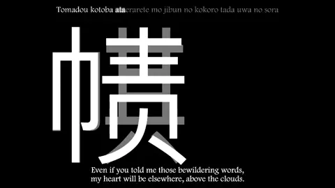

<h1 align='center'>Bad Apple</h1>  


### `bad apple_lyrics_360p.ass` - Most popular upload
YouTube: https://www.youtube.com/watch?v=FtutLA63Cp8  
NekoCap: https://nekocap.com/view/xAnFqXHiVO

### `bad apple_lyrics_1080p.ass` - Official 1080p upload
YouTube: https://www.youtube.com/watch?v=i41KoE0iMYU  
NekoCap: https://nekocap.com/view/jWFqMLHAjo

### `bad apple_ass.ass` - Bad apple but it's ASS captions (under 20mb)
**DON'T open this file**, it makes aegisub freeze while loading the file for some reason. instead, open  
`bad_apple_ass_noembed.ass` - Caption file without embedded fonts  

YouTube: https://www.youtube.com/watch?v=G8DjxY8FNKA   
NekoCap: https://nekocap.com/view/o1YAv1n8xh

### `bad apple.ass` - Subtitle file before feeding into scripts


### `Bad Apple!! feat.nomico.mkv` - Video file with subtitles embedded
Watch the subs without judder caused by framerate mismatch (bad apple is 29.97 fps while the youtube video is in 30 fps)

### `BadAppleFont.ttf` & `BadAppleFont.woff2` - 12.8k glyphs of bad apple
The woff2 version is embedded into `bad apple_ass.ass`  
Glyphs start at `U+4E00` and end at `U+8009`  



## ✨inspiration✨ (also see)
this 700mb version of ASS bad apple (higher effort, only using shapes): [[🍎] Bad Apple!! (feat. nomico) [Full PV][ASS FLAC][Vectorized][BAADF00D].mkv](https://nyaa.si/view/1276567)    
this other release (translation source, uses `\clip`s): [[XC] Touhou - Bad Apple!! PV (WEB 540p VP9 12-bit WavPack v0)](https://nyaa.si/view/1276867) 

## how
1. download bad apple somewhere (I used the [official upload](https://www.youtube.com/watch?v=i41KoE0iMYU) for its higher bitrate)
2. do the usual routine in aegisub (fancy typesetting and karaoke)
3. write a script that goes through every frame and turns them into vector data ([opencv](https://github.com/opencv/opencv-python) → [potracer](https://github.com/tatarize/potrace))
4. convert those vectors into [ass draw commands](https://aegisub.org/docs/latest/ass_tags/#drawing-commands)
5. shove those draw commands into `\clip`s and `\iclip`s and now you have `bad apple_lyrics_1080p.ass`


6. do the raster to vector thing but for multiple (one) shades of grey
7. turn those into draw commands
8. realize a whole file filled with draw commands would be around 50mb (not good for nekocap server probably)
9. come up with the cursed idea of creating a font just for bad apple
10. turn those vectors into a font ([helpful script](https://github.com/pteromys/svgs2ttf), [fontforge](https://fontforge.org/en-US/))
11. do some manual tweaking to get the clipped text and the animation to line up
12. compress (convert to woff2 using fontforge) and embed fonts into file
13. profit (file is now around 18mb) 



## how to use script
you don't.  
but if you really want to, understand that **I will not provide support for this script**
### requirements
- Python 3.12 (earlier versions will probably work)   
- These packages:
```
pip install potracer opencv-python pysubs2 ass-tag-parser
```
- [Fontforge](https://fontforge.org/en-US/) (optional, only required for font creation)
- [FBF-ifier](https://github.com/TypesettingTools/arch1t3cht-Aegisub-Scripts?tab=readme-ov-file#fbf-ifier) script for Aegisub. If your build of Aegisub includes Dependency Control then use that to install the script.

### instructions
1. In your subtitle file, add a rect `\clip` or `\iclip` to lines you want the script to work on. Those lines can have transforms (`\t`), but not fades (`\fad` or `\fade`). The FBF script doesn't work on those. If you want fading lines, use transforms with alpha tags.

2. Create styles for the shades you plan to use during shape generation.

3. After making a copy of your subtitle file, select the lines you would like the script to act on and use FBF-ifier on them.

4. Open `bad apple.py` and edit the settings. Change the input/output paths and add your styles to `THRESH_PALETTE`. By default, the script does not generate font data. Change `GENERATE_FONT` if you would like it to. Edit other settings if needed.

5. Run `bad apple.py`

6. If you chose to generate fonts, run `svgs2ttf.py`. It takes the location of the font data json as an argument.
  ```
  .\svgs2ttf-master\svgs2ttf.py .\bad_apple_font.json
  ```
7. Install the generated ttf.

8. Keep tweaking settings in the script and styles in the subtitle file until it looks right.

9. Embed fonts using File>Attachments in Aegisub. To embed a woff2 font, change the file's extension from `.woff2` to `.ttf` and then select the file in the file dialog. The renderer will read the embedded font just fine. 

## font thing
I was originally going to use the "Supplementary Private Use Area-A" `(U+F0000..U+FFFFF)` unicode block to store the glyphs. The "Private Use Area" `(U+E000..U+F8FF)` block would not fit the 13,000 glyphs needed for all the vector drawings. It showed up in Aegisub but when I played the file in nekocap, libass complained about missing glyphs. Playback in mpv was the same. Thinking the problem may be caused by libass simply not supporting such high codepoints (?), I decided to place all the glyphs into the "CJK Unified Ideographs" `(U+4E00..U+9FFF)` block, which fixed the problem. 

As a fun side effect, when the font is missing or the renderer fails to read the font, this happens:  

