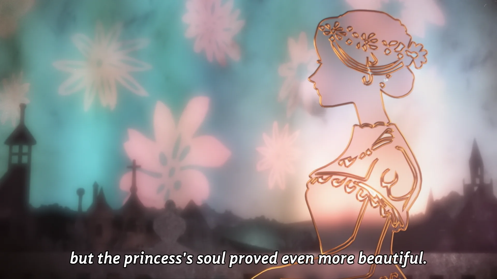

<h1 align='center'>A Cruel Fairytale - The Beautiful Princess</h1>
<table align='center'>
    <tr>
        <td>  &nbsp https://youtu.be/pA5FWtpXtLk </td>
        <td>  &nbsp https://nekocap.com/view/1OKIXR2iFj </td>
    </tr>
</table>

<table align='center'>
    <tr>
        <!-- Subtitle source -->
        <td><b>Subtitle source</b></td>
        <!--  [[MTBB] Monogatari Series Off & Monster Season - 6.5 (WEB 1080p)](https://nyaa.si/view/1861843)  -->
        <td><a href="https://nyaa.si/view/1861843">[MTBB] Monogatari Series Off &amp; Monster Season - 6.5 (WEB 1080p)</a></td>
    </tr>
</table>

**Uploaded:** August 18, 2024  
**Last updated:** August 18, 2024

<!-- Description goes here -->
Episode 6.5 of Monogatari Series: Off & Monster Season

## Folder info

| File | Description |
| ---- | ----------- |
[`[MiniMTBB] Monogatari Series Off & Monster Season - 06.5 (WEB 1080p) [21007471]_track3_[eng].ass`](%5BMiniMTBB%5D%20Monogatari%20Series%20Off%20%26%20Monster%20Season%20-%2006.5%20%28WEB%201080p%29%20%5B21007471%5D_track3_%5Beng%5D.ass) | Subtitle file |

## Font list

| Filename | Font name | NekoCap font? |
| ---- | ---- | :--: |
 [`Comfortaa-Regular.ttf`](https://github.com/abrokecube/subtitles-fonts/tree/main/NekoCap%20fonts/Comfortaa-Regular.ttf) | Comfortaa Regular | ✔️ |
 [`erasdus0.ttf`](https://github.com/abrokecube/subtitles-fonts/tree/main/NekoCap%20fonts/erasdus0.ttf) | EraserDust | ✔️ |
 [`GandhiSans-BoldItalic.otf`](https://github.com/abrokecube/subtitles-fonts/tree/main/NekoCap%20fonts/GandhiSans-BoldItalic.otf) | GandhiSans-BoldItalic | ✔️ |
 [`Merriweather-Regular.ttf`](https://github.com/abrokecube/subtitles-fonts/tree/main/NekoCap%20fonts/Merriweather-Regular.ttf) | Merriweather Regular | ✔️ |

<!-- Permissions -->
## 
You are free to use these subtitles for whatever purpose. Please retain any credits listed in the subs. Credit to me is not required, but is appriciated.
