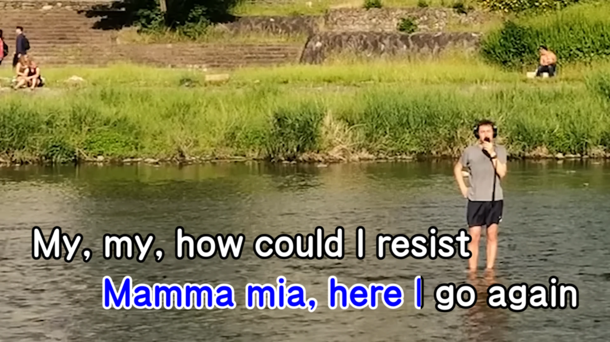

<h1 align='center'>Austin Weber - Mamma Mia</h1>

<table align='center'>
    <tr>
        <td>  &nbsp https://youtu.be/kewXtkGmDtw </td>
        <td>  &nbsp https://nekocap.com/view/4mjJbA4YmG </td>
    </tr>
</table>

<table align='center'>
</table>

**Uploaded:** November 08, 2024  
**Last updated:** November 08, 2024

<!-- Description goes here -->
Tried to replicate the look of some karaoke machines' lyric displays

## Folder info

| File | Description |
| ---- | ----------- |
[`final.ass`](final.ass) | Subtitle file with template applied |
[`mamma mia austin weber.ass`](mamma%20mia%20austin%20weber.ass) | Base subtitle file |
[`karaoke.py`](karaoke.py) | Karaoke template (requires PyonFX) |

## Font list

| Filename | Font name | NekoCap font? |
| ---- | ---- | :--: |
 [`FOTC-ARTeyuanGBHeavy.otf`](./fonts/FOTC-ARTeyuanGBHeavy.otf) | FOTCARTeyuanGB-Heavy | ❌ |

<!-- Permissions -->
## 
You are free to use these subtitles for whatever purpose. Please retain any credits listed in the subs. Credit to me is not required, but is appreciated.
