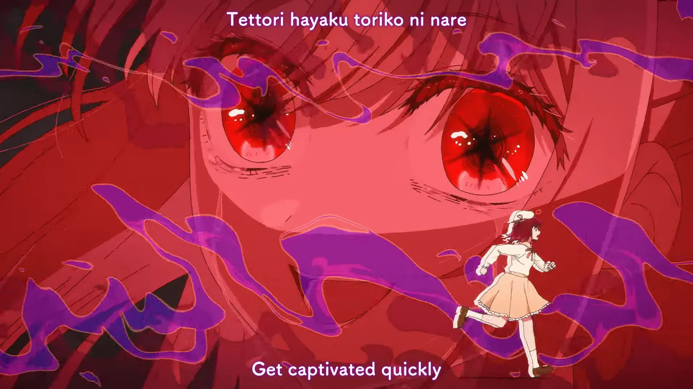

<h1 align='center'>B-Komachi - POP IN 2</h1>

<table align='center'>
    <tr>
        <td>  &nbsp https://youtu.be/c7E-tgmFuzw </td>
        <td>  &nbsp https://nekocap.com/view/HjsuRQvSVU </td>
    </tr>
</table>

<table align='center'>
    <tr>
        <!-- TL/Romanji -->
        <td><b>TL/Romanji</b></td>
        <!--  [Thae(rin) @ Lyrical Nonsense](https://www.lyrical-nonsense.com/global/lyrics/b-komachi/pop-in-2/) -->
        <td><a href="https://www.lyrical-nonsense.com/global/lyrics/b-komachi/pop-in-2/">Thae(rin) @ Lyrical Nonsense</a></td>
    </tr>
</table>

**Uploaded:** October 18, 2024  
**Last updated:** October 18, 2024

<!-- Description goes here -->
no k-timing here

## Folder info

| File | Description |
| ---- | ----------- |
[`pop in 2.ass`](pop%20in%202.ass) | Subtitle file |

## Font list

| Filename | Font name | NekoCap font? |
| ---- | ---- | :--: |
 [`Comfortaa-700.ttf`](https://github.com/abrokecube/subtitles-fonts/tree/main/NekoCap%20fonts/Comfortaa-700.ttf) | Comfortaa Bold | ✔️ |
 [`FOT-TsukuARdGothicStd-E.otf`](./fonts/FOT-TsukuARdGothicStd-E.otf) | TsukuARdGothicStd-E | ❌ |

<!-- Permissions -->
## 
You are free to use these subtitles for whatever purpose. Please retain any credits listed in the subs. Credit to me is not required, but is appriciated.
