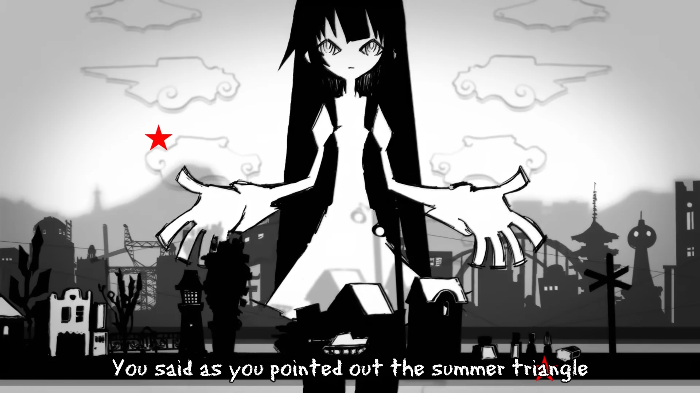

<h1 align='center'>Bakemonogatari ED - supercell - Kimi no shiranai monogatari</h1>

<table align='center'>
    <tr>
        <td>  &nbsp https://youtu.be/rZZzlY8vUf8 </td>
        <td>  &nbsp https://nekocap.com/view/G2xBb78zJM </td>
    </tr>
</table>

<table align='center'>
    <tr>
        <!-- Translation source -->
        <td><b>Translation source</b></td>
        <!--  [[MTBB] Monogatari Series (BD 1080p) | Bakemonogatari, Kizumonogatari, Nisemonogatari...](https://nyaa.si/view/1582135) -->
        <td><a href="https://nyaa.si/view/1582135">[MTBB] Monogatari Series (BD 1080p) | Bakemonogatari, Kizumonogatari, Nisemonogatari...</a></td>
    </tr>
</table>

**Uploaded:** September 09, 2024  
**Last updated:** September 09, 2024

<!-- Description goes here -->

## Folder info

| File | Description |
| ---- | ----------- |
[`Kimi no shiranai monogatari.ass`](Kimi%20no%20shiranai%20monogatari.ass) | Subtitle file |

## Font list

| Filename | Font name | NekoCap font? |
| ---- | ---- | :--: |
 [`Comfortaa-Regular.ttf`](https://github.com/abrokecube/subtitles-fonts/tree/main/NekoCap%20fonts/Comfortaa-Regular.ttf) | Comfortaa Regular | ✔️ |
 [`erasdus0.ttf`](https://github.com/abrokecube/subtitles-fonts/tree/main/NekoCap%20fonts/erasdus0.ttf) | EraserDust | ✔️ |

<!-- Permissions -->
## 
You are free to use these subtitles for whatever purpose. Please keep any credits listed in the subs. Credit is not required, but is appreciated.
