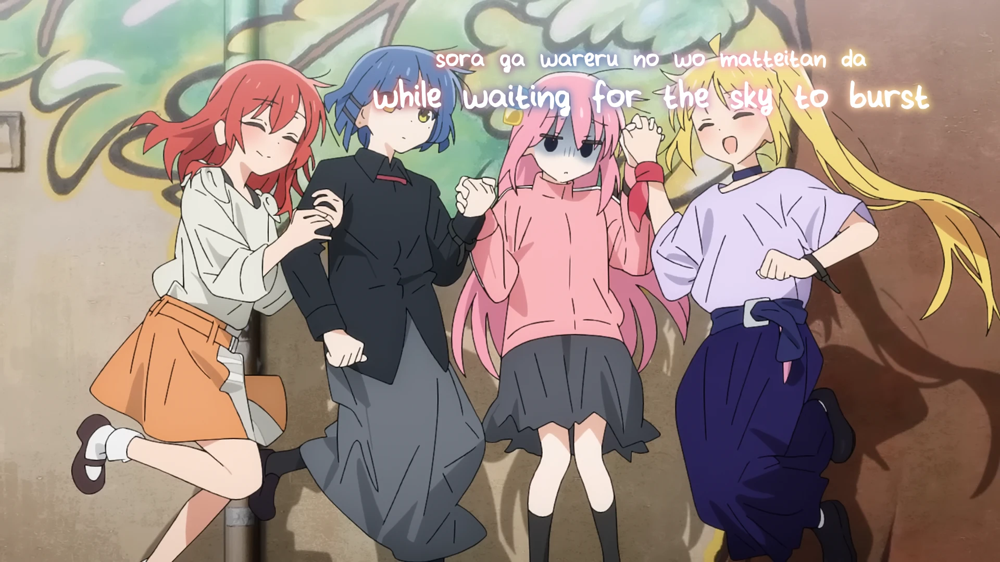

<h1 align='center'>Bocchi the Rock! OP - Seishun Complex</h1>

<table align='center'>
    <tr>
        <td>  &nbsp https://youtu.be/Yd8kUoB72xU </td>
        <td>  &nbsp https://nekocap.com/view/kMJpwcH3UB </td>
    </tr>
</table>

<table align='center'>
    <tr>
        <!-- Source -->
        <td><b>Source</b></td>
        <!--  [[DB+neohevc] Bocchi the Rock! [10bit BD1080p][HEVC-x265]](https://nyaa.si/view/1678808) -->
        <td><a href="https://nyaa.si/view/1678808">[DB+neohevc] Bocchi the Rock! [10bit BD1080p][HEVC-x265]</a></td>
    </tr>
</table>

**Uploaded:** October 19, 2024  
**Last updated:** October 19, 2024

<!-- Description goes here -->

## Folder info

| File | Description |
| ---- | ----------- |
[`seishun complex.ass`](seishun%20complex.ass) | Subtitle file |

## Font list

| Filename | Font name | NekoCap font? |
| ---- | ---- | :--: |
 [`SpongeMeetsVanilla.ttf`](./fonts/SpongeMeetsVanilla.ttf) | SpongeMeetsVanilla | ❌ |

<!-- Permissions -->
## 
You are free to use these subtitles for whatever purpose. Credit is not required, but is appriciated.
