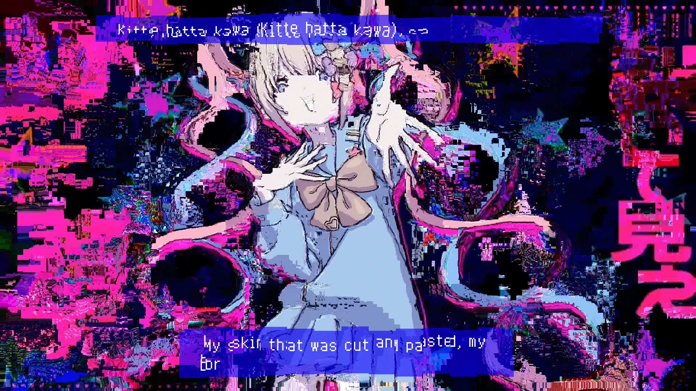

<h1 align='center'>Cubibibibism</h1>

<table align='center'>
    <tr>
        <td>  &nbsp https://youtu.be/DjGxGMxvg4M </td>
        <td>  &nbsp https://nekocap.com/view/0nxVKRIJ8C </td>
    </tr>
</table>

<table align='center'>
</table>

**Uploaded:** November 15, 2024  
**Last updated:** November 15, 2024

<!-- Description goes here -->
Original version:  [Cubism](../Cubism)  

## Folder info

| File | Description |
| ---- | ----------- |
[`cubibibibism.ass`](cubibibibism.ass) | Subtitle file |
[`cubibibibism noglitch.ass`](cubibibibism%20noglitch.ass) | Subtitle file before applying glitch effects |
[`scripts/rectcliptoshape.py`](scripts/rectcliptoshape.py) | Creates a shape that fills a rectangular clip |
[`scripts/scalefrompoint.lua`](scripts/scalefrompoint.lua) | Luainterpret script - Scales lines from a point |
[`scripts/scalefrompoint.py`](scripts/scalefrompoint.py) | Scales lines from a point - Python version |
[`scripts/tagcleanup.py`](scripts/tagcleanup.py) | Removes redundant tags |
[`scripts/tileglitch.lua`](scripts/tileglitch.lua) | Luainterpret script - Divides a line into tiles and randomizes position |
[`scripts/ass_tag_parser`](scripts/ass_tag_parser) | Modified version of [bubblesub/ass_tag_parser](https://github.com/bubblesub/ass_tag_parser) to be used with these python scripts |

## Font list

| Filename | Font name | NekoCap font? |
| ---- | ---- | :--: |
 [`Zpix-cubism.ttf`](./fonts/Zpix-cubism.ttf) | Zpix cubism | ❌ |

<!-- Permissions -->
## 
You are free to use these subtitles for whatever purpose. Please retain any credits listed in the subs. Credit to me is not required, but is appriciated.
