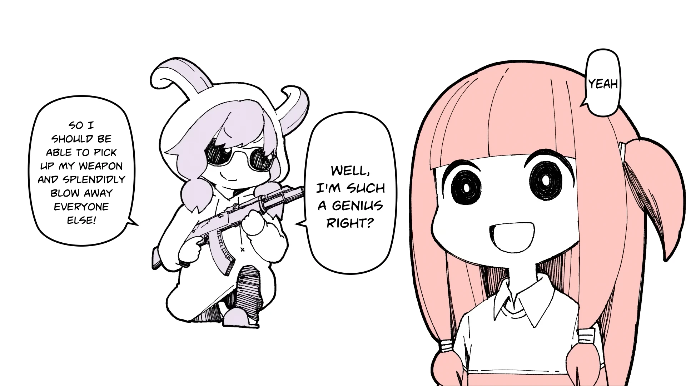
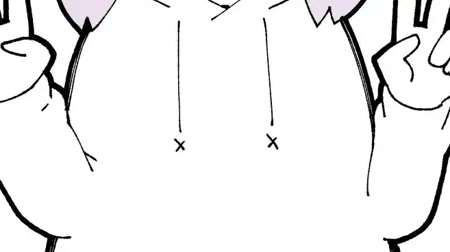

<h1 align='center'>GYARI - Akane-chan Will Listen to Whatever You Have to Say</h1>

<table align='center'>
    <tr>
        <td>  &nbsp https://youtu.be/OVuYIMa5XBw </td>
        <td>  &nbsp https://nekocap.com/view/Q5OOh2MlsX </td>
    </tr>
</table>
<table align='center'>
    <tr>
        <td><b>Hardsub</b></td>
        <td>https://youtu.be/qwCK0obJdyA</td>
    </tr>
</table>

<table align='center'>
    <tr>
        <!-- Translation -->
        <td><b>Translation</b></td>
        <!--  aquariantwin (Magenetra) via [Vocaloid Lyrics Wiki](https://www.youtube.com/watch?v=OVuYIMa5XBw&nekocap=Q5OOh2MlsX) -->
        <td>aquariantwin (Magenetra) via <a href="https://www.youtube.com/watch?v=OVuYIMa5XBw&amp;nekocap=Q5OOh2MlsX">Vocaloid Lyrics Wiki</a></td>
    </tr>
    <tr>
        <!-- Other translations -->
        <td><b>Other translations</b></td>
        <!--  ChatGPT-4o -->
        <td>ChatGPT-4o</td>
    </tr>
</table>

**Uploaded:** August 26, 2024  
**Last updated:** August 26, 2024

<!-- Description goes here -->

## Folder info

| File | Description |
| ---- | ----------- |
[`akane-chan will listen.ass`](akane-chan%20will%20listen.ass) | Base subtitle file |
[`akane-chan will listen.assfonts.cleaned.export.ass`](akane-chan%20will%20listen.assfonts.cleaned.export.ass) | Cleaned subtitle file with embedded fonts |
[`akanechan kara.ass`](akanechan%20kara.ass) | Karaoke subs for YouTube upload |
[`akanechan kara_fbf.ass`](akanechan%20kara_fbf.ass) | Karaoke subs split to frame-by-frame lines (makes karaoke effects work properly when exported) |
[`akanechan kara_fbf.ytt`](akanechan%20kara_fbf.ytt) | Exported file for YouTube |
[`transition.webp`](transition.webp) | Demonstration for `wipe.ass` |
[`wipe.aegs`](wipe.aegs) | Karaoke template for wipe transition (use with [aegsc](https://github.com/butterfansubs/aegsc) and [The0x539's templater](https://github.com/The0x539/Aegisub-Scripts/blob/trunk/src/0x.KaraTemplater.moon)) |

`wipe.aegs` demonstration:  

## Font list

| Filename | Font name | NekoCap font? |
| ---- | ---- | :--: |
 [`AvenirNext-Heavy.ttf`](./fonts/AvenirNext-Heavy.ttf) | Avenir Next Heavy | ❌ |
 [`BeelzebrushBlackBB.otf`](./fonts/BeelzebrushBlackBB.otf) | BeelzebrushBlackBB | ❌ |
 [`FOT-MatisseProN-EB.otf`](./fonts/FOT-MatisseProN-EB.otf) | MatisseProN-EB | ❌ |
 [`FOT-RodinProN-B.otf`](./fonts/FOT-RodinProN-B.otf) | RodinProN-B | ❌ |
 [`FOT-RodinProN-UB.otf`](./fonts/FOT-RodinProN-UB.otf) | RodinProN-UB | ❌ |
 [`KGSecondChances-Solid.ttf`](./fonts/KGSecondChances-Solid.ttf) | KG Second Chances Solid | ❌ |
 [`Open-Sans-700.ttf`](https://github.com/abrokecube/subtitles-fonts/tree/main/NekoCap%20fonts/Open-Sans-700.ttf) | Open Sans Bold | ✔️ |
 [`OpenSans-Regular.ttf`](https://github.com/abrokecube/subtitles-fonts/tree/main/NekoCap%20fonts/OpenSans-Regular.ttf) | Open Sans Regular | ✔️ |
 [`Roboto-Regular.ttf`](https://github.com/abrokecube/subtitles-fonts/tree/main/NekoCap%20fonts/Roboto-Regular.ttf) | Roboto | ✔️ |
 [`UnmaskedBB.otf`](./fonts/UnmaskedBB.otf) | UnmaskedBB | ❌ |
 [`UnmaskedBB_bold.otf`](./fonts/UnmaskedBB_bold.otf) | UnmaskedBB-Bold | ❌ |

<!-- Permissions -->
## 
You are free to use these subtitles for whatever purpose. Please retain any credits listed in the subs. Credit to me is not required, but is appreciated.
