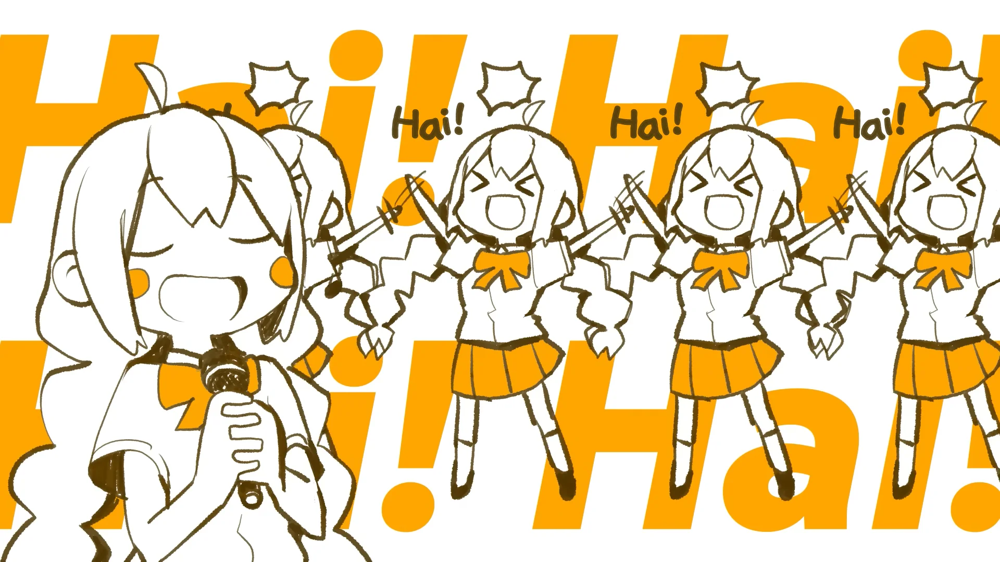

<h1 align='center'>GYARI - Akari Has Arrived!</h2>

<table align='center'>
    <tr>
        <td>  &nbsp https://youtu.be/tyneiz9FRMw </td>
        <td>  &nbsp https://nekocap.com/view/KQdrveI0BB </td>
    </tr>
</table>

<table align='center'>
    <tr>
        <td> <b>Lyrics Translation</b> </td>
        <td> Anonymous via <a href='https://vocaloidlyrics.fandom.com/wiki/%E3%82%A2%E3%82%AB%E3%83%AA%E3%81%8C%E3%82%84%E3%81%A3%E3%81%A6%E3%81%8D%E3%81%9F%E3%81%9E%E3%81%A3_(Akari_ga_Yatte_Kita_zo)'> Vocaloid Lyrics Wiki </a> </td>
    </tr>
    <tr>
        <td> <b> Other translations </b> </td>
        <td>ChatGPT-4o</td>
    </tr>
</table>

**Uploaded:** September 17, 2024  
**Last updated:** October 11, 2024

Japanese onomatopoeia gaming  
For all her little untranslated gremlin noises, I deviated from the romanization and tried my best to make them sound more English  
GPT didn't know what "iyanhoho" was, jisho said it was a slang term for 'earphones.' Thanks [jisho](https://jisho.org/)  
The file I submitted has been time shifted backwards by 1 frame. Makes the appearing dialogue bubbles look better on my machine, idk about yours. Please send me your feedback.

## Folder info

| File | Description |
| ---- | ----------- |
| [`akari has arrived!.ass`](./akari%20has%20arrived!.ass) | Base subtitle file |

## Font list
| Filename | Font name | NekoCap font? |
| ---- | ---- | :--: |
| [`a22c5070c2e6f6a022db9a03e30b8300.ttf`](./fonts/a22c5070c2e6f6a022db9a03e30b8300.ttf) | Madera |   ❌ |
| [`CCAstronautsInTrouble-Regular.ttf`](https://github.com/abrokecube/subtitles-fonts/blob/main/NekoCap%20fonts/CCAstronautsInTrouble-Regular.ttf) | CC AstronautsInTrouble |  ✔️  |
| [`Gaegu-But-Better-Regular - Copy - Copy.ttf`](./fonts/Gaegu-But-Better-Regular%20-%20Copy%20-%20Copy.ttf) | Gaegu But Better | ❌  |
| [`KGSecondChances-Solid.ttf`](./fonts/KGSecondChances-Solid.ttf) | KG Second Chances Solid |  ❌ |

##
You are free to use these subtitles for whatever purpose. Please retain any credits listed in the subs. Credit to me is not required, but is appriciated.