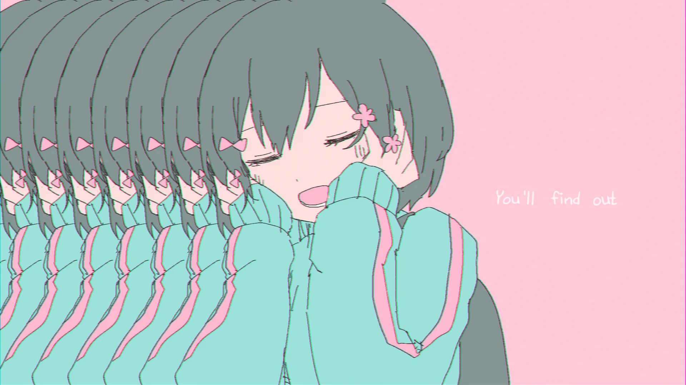

<h1 align='center'>Iyowa - Kyu-kurarin</h2>

<table align='center'>
    <tr>
        <td>  &nbsp https://youtu.be/2b1IexhKPz4 </td>
        <td>  &nbsp https://nekocap.com/view/EiRyA9JJhb </td>
    </tr>
</table>

<table align='center'>
    <tr>
        <td> Translation </td>
        <td> AngelSubs via <a href='https://vocaloidlyrics.fandom.com/wiki/%E3%81%8D%E3%82%85%E3%81%86%E3%81%8F%E3%82%89%E3%82%8A%E3%82%93_(Kyuukurarin)'>Vocaloid Lyrics Wiki</a> </td>
    </tr>
</table>

## Folder info

| File | Description |
| ---- | ----------- |
|`kyu-kurarin.ass` | Base subtitle file, somewhat editable |
|`kyu-kurarin.burned.ass` | Text converted to shapes, omits masking at 3:01, as the lag was too distracting |
|`kyu-kurarin.export.ass` | File with comments removed; submitted file |

## Font list
| Filename | Font name |
| ---- | ---- |
|`LEHN026.ttf`| LEHN026 |

##
You are free to use these subtitles for whatever purpose. Credit is not required, but is appriciated.