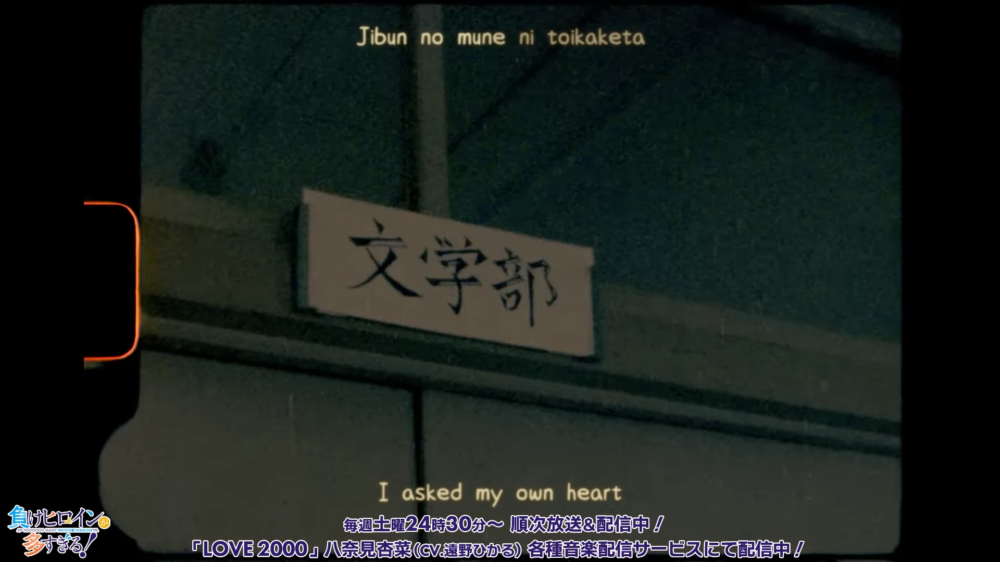

<h1 align='center'>Makeine ED1 - LOVE 2000</h1>

<table align='center'>
    <tr>
        <td>  &nbsp https://youtu.be/2czbGCYz6gk </td>
        <td>  &nbsp https://nekocap.com/view/KX4vE8paHQ </td>
    </tr>
</table>

<table align='center'>
    <tr>
        <!-- Translation -->
        <td><b>Translation</b></td>
        <!--  [Anime Song Lyrics](https://www.animesonglyrics.com/make-heroine-ga-oosugiru/love2000) -->
        <td><a href="https://www.animesonglyrics.com/make-heroine-ga-oosugiru/love2000">Anime Song Lyrics</a></td>
    </tr>
</table>

**Uploaded:** September 05, 2024  
**Last updated:** September 06, 2024

<!-- Description goes here -->

## Folder info

| File | Description |
| ---- | ----------- |
[`makeine - love2000.ass`](makeine%20-%20love2000.ass) | Subtitle file |
[`retime.aegs`](retime.aegs) | Functions to time romanji to english lyrics |
[`shake.aegs`](shake.aegs) | Functions to replicate film shake (they call it "gate weave") |

## Font list

| Filename | Font name | NekoCap font? |
| ---- | ---- | :--: |
 [`JasonHandwriting4.ttf`](https://github.com/abrokecube/subtitles-fonts/tree/main/NekoCap%20fonts/JasonHandwriting4.ttf) | JasonHandwriting4 Regular | ✔️ |

<!-- Permissions -->
## 
You are free to use these subtitles for whatever purpose. Please retain any credits listed in the subs. Credit to me is not required, but is appriciated.
