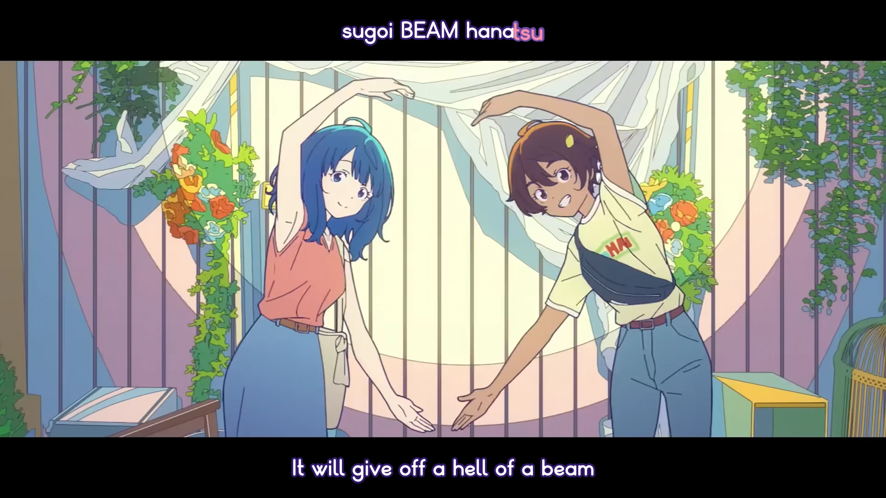

<h1 align='center'>Makeine OP - Tsuyogaru Girl</h1>

<table align='center'>
    <tr>
        <td>  &nbsp https://youtu.be/7GJOBkIgWHc </td>
        <td>  &nbsp https://nekocap.com/view/NHppKo4mZO </td>
    </tr>
</table>

<table align='center'>
    <tr>
        <!-- Translation -->
        <td><b>Translation</b></td>
        <!--  Official (YouTube captions) -->
        <td>Official (YouTube captions)</td>
    </tr>
</table>

**Uploaded:** September 09, 2024  
**Last updated:** September 09, 2024

<!-- Description goes here -->

## Folder info

| File | Description |
| ---- | ----------- |
[`makeine op - tsuyogaru girl.assfonts.ass`](makeine%20op%20-%20tsuyogaru%20girl.assfonts.ass) | Subtitle file |
[`lyrics_syl.txt`](lyrics_syl.txt) | Lyrics split to syllables |
[`unknown artist - Tsuyogaru GIRL (abrokecube).osz`](unknown%20artist%20-%20Tsuyogaru%20GIRL%20%28abrokecube%29.osz) | osu! beatmap timed and hitsounded to lyrics |

## Font list

| Filename | Font name | NekoCap font? |
| ---- | ---- | :--: |
 [`FOT-ZadokaBold.otf`](./fonts/FOT-ZadokaBold.otf) | FOTZadokaBold | ❌ |

<!-- Permissions -->
## 
You are free to use these subtitles for whatever purpose. Credit is not required, but is appriciated.
