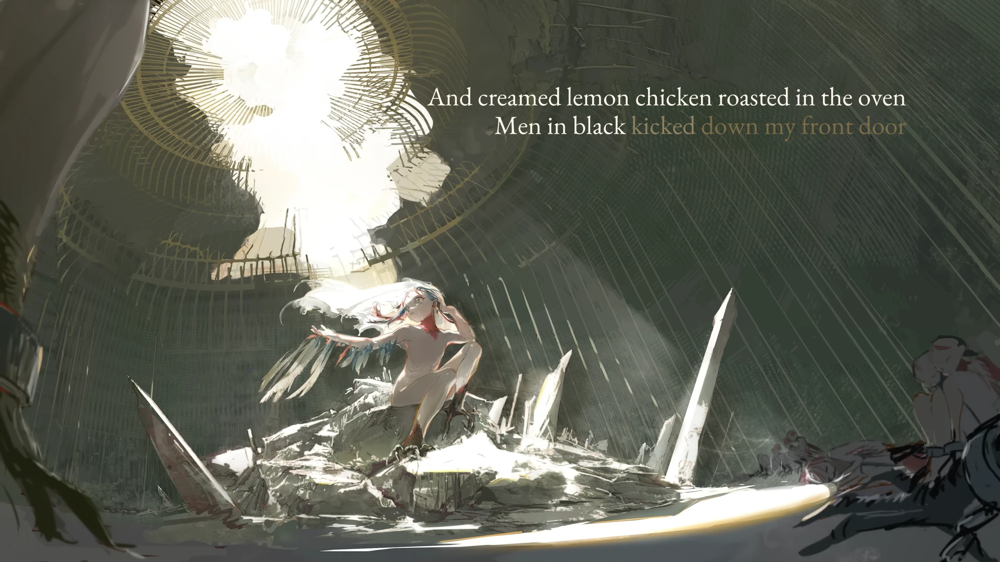

<h1 align='center'>Mili - Salt, Pepper, Birds, and the Thought Police</h1>

<table align='center'>
    <tr>
        <td>  &nbsp https://youtu.be/Dca9gJyjoAg </td>
        <td>  &nbsp https://nekocap.com/view/eFbiB2cSIM </td>
    </tr>
</table>

<table align='center'>
</table>

**Uploaded:** September 12, 2024  
**Last updated:** September 12, 2024

<!-- Description goes here -->

## Folder info

| File | Description |
| ---- | ----------- |
[`Salt, Pepper, Birds, and the Thought Police.ass`](Salt%2C%20Pepper%2C%20Birds%2C%20and%20the%20Thought%20Police.ass) | Subtitle file |

## Font list

| Filename | Font name | NekoCap font? |
| ---- | ---- | :--: |
 [`EB-Garamond-Regular.ttf`](https://github.com/abrokecube/subtitles-fonts/tree/main/NekoCap%20fonts/EB-Garamond-Regular.ttf) | EB Garamond Regular | ✔️ |

<!-- Permissions -->
## 
You are free to use these subtitles for whatever purpose. Please keep any credits listed in the subs. Credit is not required, but is appreciated.
