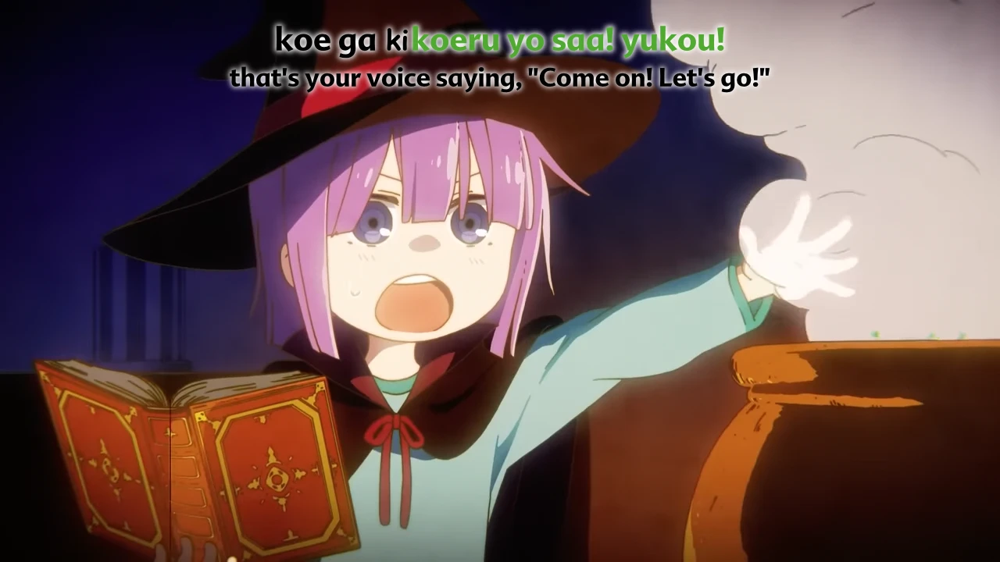

<h1 align='center'>Miss Kobayashi's Dragon Maid OP - Blue Sky Rhapsody</h1>

<table align='center'>
    <tr>
        <td>  &nbsp https://youtu.be/Ku5fgOHy1JY </td>
        <td>  &nbsp https://nekocap.com/view/HQ7p5V9zIo </td>
    </tr>
</table>

<table align='center'>
    <tr>
        <!-- Source -->
        <td><b>Source</b></td>
        <!--  [[0x539] Miss Kobayashi's Dragon Maid (Kobayashi-san Chi no Maidragon) - S01 (S1) (BD 1080p x264 Hi10P FLAC)](https://nyaa.si/view/1221461) -->
        <td><a href="https://nyaa.si/view/1221461">[0x539] Miss Kobayashi's Dragon Maid (Kobayashi-san Chi no Maidragon) - S01 (S1) (BD 1080p x264 Hi10P FLAC)</a></td>
    </tr>
</table>

**Uploaded:** October 18, 2024  
**Last updated:** October 18, 2024

<!-- Description goes here -->

## Folder info

| File | Description |
| ---- | ----------- |
[`blue sky rhapsody.ass`](blue%20sky%20rhapsody.ass) | Subtitle file |

## Font list

| Filename | Font name | NekoCap font? |
| ---- | ---- | :--: |
 [`Advert-Bold.otf`](./fonts/Advert-Bold.otf) | Advert-Bold | ❌ |
 [`AltonaBold.otf`](./fonts/AltonaBold.otf) | AltonaBold | ❌ |
 [`ARISTON1.TTF`](./fonts/ARISTON1.TTF) | Ariston | ❌ |
 [`comicbd.ttf`](./fonts/comicbd.ttf) | Comic Sans MS Bold | ❌ |
 [`Embryonic-Inside-RegularM.ttf`](./fonts/Embryonic-Inside-RegularM.ttf) | Embryonic Inside-Mod | ❌ |
 [`glashou.ttf`](./fonts/glashou.ttf) | Glass Houses | ❌ |
 [`HWYGWDE.TTF`](./fonts/HWYGWDE.TTF) | Highway Gothic Wide | ❌ |
 [`LEXIB.TTF`](./fonts/LEXIB.TTF) | Lexia Bold | ❌ |
 [`MaplestoryLight.ttf`](https://github.com/abrokecube/subtitles-fonts/tree/main/NekoCap%20fonts/MaplestoryLight.ttf) | Maplestory Light | ✔️ |
 [`NewRodinPro-B-Str.otf`](./fonts/NewRodinPro-B-Str.otf) | NewRodinPro-B-Str | ❌ |
 [`OLDENGL.TTF`](./fonts/OLDENGL.TTF) | Old English Text MT | ❌ |
 [`One Off Title.ttf`](./fonts/One%20Off%20Title.ttf) | One Off title | ❌ |
 [`Retropop.otf`](./fonts/Retropop.otf) | Retropop | ❌ |
 [`Scratch_Regular.ttf`](./fonts/Scratch_Regular.ttf) | Scratch | ❌ |
 [`SF Archery Black.ttf`](./fonts/SF%20Archery%20Black.ttf) | SF Archery Black | ❌ |
 [`SF_Junk_Culture.ttf`](./fonts/SF_Junk_Culture.ttf) | SF Junk Culture | ❌ |
 [`Sketchh.ttf`](./fonts/Sketchh.ttf) | SketchHeavy Regular | ❌ |
 [`SOUTANB.TTF`](./fonts/SOUTANB.TTF) | Soutane Bold | ❌ |
 [`Splash.ttf`](./fonts/Splash.ttf) | Splash | ❌ |
 [`timesbd.ttf`](./fonts/timesbd.ttf) | Times New Roman Bold | ❌ |
 [`URWAlcuinT.ttf`](./fonts/URWAlcuinT.ttf) | URWAlcuinT | ❌ |

<!-- Permissions -->
## 
You are free to use these subtitles for whatever purpose. Credit is not required, but is appriciated.
