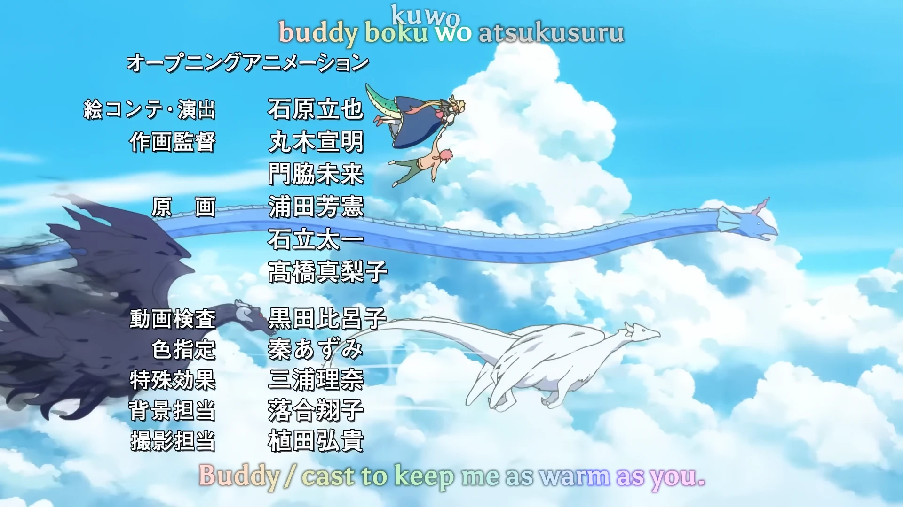

<h1 align='center'>Miss Kobayashi's Dragon Maid S OP - Ai no Supreme!</h1>

<table align='center'>
    <tr>
        <td>  &nbsp https://youtu.be/KVV5Hh2RHoA </td>
        <td>  &nbsp https://nekocap.com/view/0NvTGUeY65 </td>
    </tr>
</table>

<table align='center'>
    <tr>
        <!-- Source -->
        <td><b>Source</b></td>
        <!--  [[WBDP] [0x539] Kobayashi-san Chi no Maid Dragon S / Miss Kobayashi's Dragon Maid S + OVA [BD][1080p-FLAC][HEVC]](https://nyaa.si/view/1572678) -->
        <td><a href="https://nyaa.si/view/1572678">[WBDP] [0x539] Kobayashi-san Chi no Maid Dragon S / Miss Kobayashi's Dragon Maid S + OVA [BD][1080p-FLAC][HEVC]</a></td>
    </tr>
</table>

**Uploaded:** October 18, 2024  
**Last updated:** October 18, 2024

<!-- Description goes here -->

## Folder info

| File | Description |
| ---- | ----------- |
[`ai no supreme.ass`](ai%20no%20supreme.ass) | Subtitle file |

## Font list

| Filename | Font name | NekoCap font? |
| ---- | ---- | :--: |
 [`Asul-Bold.ttf`](./fonts/Asul-Bold.ttf) | Asul Bold | ❌ |
 [`MaplestoryLight.ttf`](https://github.com/abrokecube/subtitles-fonts/tree/main/NekoCap%20fonts/MaplestoryLight.ttf) | Maplestory Light | ✔️ |
 [`THROW MY HANDS UP IN THE AIR.TTF`](./fonts/THROW%20MY%20HANDS%20UP%20IN%20THE%20AIR.TTF) | Throw My Hands Up in the Air | ❌ |

<!-- Permissions -->
## 
You are free to use these subtitles for whatever purpose. Please keep any credits listed in the subs. Credit is not required, but is appreciated.
