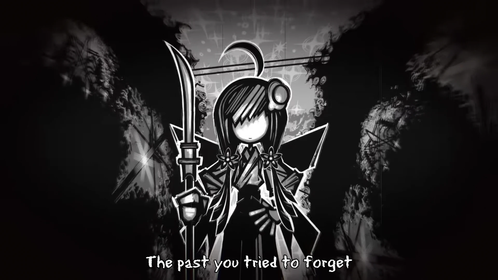

<h1 align='center'>EDv1 - Nadeko Past Ver.</h1>

<table align='center'>
    <tr>
        <td>  &nbsp https://youtu.be/jAAZDIGWcio </td>
        <td>  &nbsp https://nekocap.com/view/zCzpkdCG9w </td>
    </tr>
</table>

<table align='center'>
    <tr>
        <!-- Subtitle source -->
        <td><b>Subtitle source</b></td>
        <!--  [[MTBB] Monogatari Series Off & Monster Season - 04 (WEB 1080p)](https://nyaa.si/view/1852772) -->
        <td><a href="https://nyaa.si/view/1852772">[MTBB] Monogatari Series Off &amp; Monster Season - 04 (WEB 1080p)</a></td>
    </tr>
</table>

**Uploaded:** August 03, 2024  
**Last updated:** August 03, 2024

<!-- Description goes here -->
Ending video shown in episodes 1-6 of Monogatari Series: Off & Monster Season

## Folder info

| File | Description |
| ---- | ----------- |
[`undead - monogatari off monster season ed.ass`](undead%20-%20monogatari%20off%20monster%20season%20ed.ass) | Subtitle file |

## Font list

| Filename | Font name | NekoCap font? |
| ---- | ---- | :--: |
 [`Comfortaa-Regular.ttf`](https://github.com/abrokecube/subtitles-fonts/blob/main/NekoCap%20fonts/Comfortaa-Regular.ttf) | Comfortaa Regular | ✔️ |
 [`erasdus0.ttf`](https://github.com/abrokecube/subtitles-fonts/blob/main/NekoCap%20fonts/erasdus0.ttf) | EraserDust | ✔️ |

<!-- Permissions -->
## 
You are free to use these subtitles for whatever purpose. Please retain any credits listed in the subs. Credit to me is not required, but is appriciated.
