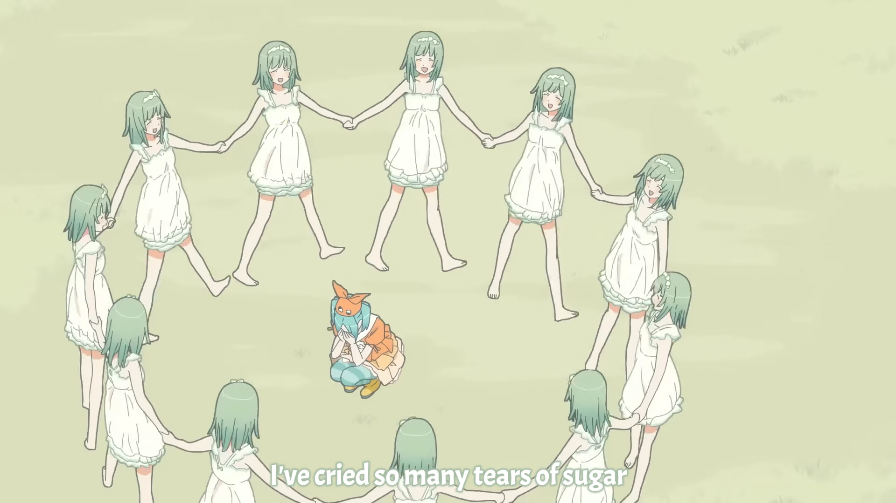

<h1 align='center'>Monogatari Off & Monster Season OP1 - caramel ribbon cursetard</h1>

<table align='center'>
    <tr>
        <td>  &nbsp https://youtu.be/yhL7GvLbSyw </td>
        <td>  &nbsp https://nekocap.com/view/LKRCYEaxax </td>
    </tr>
</table>

<table align='center'>
    <tr>
        <!-- Subtitle source -->
        <td><b>Subtitle source</b></td>
        <!--  [[MTBB] Monogatari Series Off & Monster Season - 04 (WEB 1080p)](https://nyaa.si/view/1852772) -->
        <td><a href="https://nyaa.si/view/1852772">[MTBB] Monogatari Series Off &amp; Monster Season - 04 (WEB 1080p)</a></td>
    </tr>
</table>

**Uploaded:** July 29, 2024  
**Last updated:** July 29, 2024

<!-- Description goes here -->

## Folder info

| File | Description |
| ---- | ----------- |
[`caramel ribbon cursetard.ass`](caramel%20ribbon%20cursetard.ass) | Subtitle file |

## Font list

| Filename | Font name | NekoCap font? |
| ---- | ---- | :--: |
 [`Acme-Regular.ttf`](https://github.com/abrokecube/subtitles-fonts/tree/main/NekoCap%20fonts/Acme-Regular.ttf) | Acme Regular | ✔️ |
 [`Sarabun-700.ttf`](https://github.com/abrokecube/subtitles-fonts/tree/main/NekoCap%20fonts/Sarabun-700.ttf) | Sarabun Bold | ✔️ |
 [`Sarabun-Regular.ttf`](https://github.com/abrokecube/subtitles-fonts/tree/main/NekoCap%20fonts/Sarabun-Regular.ttf) | Sarabun Regular | ✔️ |

<!-- Permissions -->
## 
You are free to use these subtitles for whatever purpose. Please keep any credits listed in the subs. Credit is not required, but is appreciated.
