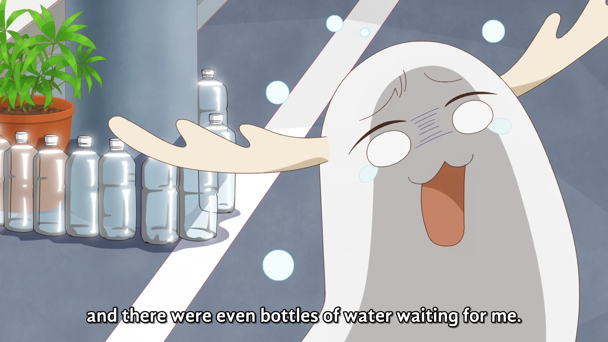

<h1 align='center'>Compilation of Episode 1-3</h1>

<table align='center'>
    <tr>
        <td colspan=2 align=center>  &nbsp https://youtu.be/GT-rbPzXDnE </td>
    </tr>
    <tr>
        <td>  &nbsp<b>YouDeer:</b> https://nekocap.com/view/6kMwVw3vuR </td>
        <td>  &nbsp<b>DeerGod/DeerStalker:</b> https://nekocap.com/view/lvUwVtnsz9 </td>
    </tr>
</table>

<table align='center'>
</table>

**Uploaded:** August 20, 2024  
**Last updated:** September 17, 2024

<!-- Description goes here -->

## Folder info

| File | Description |
| ---- | ----------- |
[`deergod-deerstalker.ass`](deergod-deerstalker.ass) | English (Canada) subtitle file |
[`youdeer.ass`](youdeer.ass) | English (United States) subtitle file |

## Font list

| Filename | Font name | NekoCap font? |
| ---- | ---- | :--: |
 [`AndikaBasic.ttf`](https://github.com/abrokecube/subtitles-fonts/tree/main/NekoCap%20fonts/AndikaBasic.ttf) | Andika Basic | ✔️ |
 [`ArtificeSSK.ttf`](https://github.com/abrokecube/subtitles-fonts/tree/main/NekoCap%20fonts/ArtificeSSK.ttf) | ArtificeSSK | ✔️ |
 [`BadaBoomProBB.ttf`](https://github.com/abrokecube/subtitles-fonts/tree/main/NekoCap%20fonts/BadaBoomProBB.ttf) | Bada Boom Pro BB | ✔️ |
 [`Caveat-700.ttf`](https://github.com/abrokecube/subtitles-fonts/tree/main/NekoCap%20fonts/Caveat-700.ttf) | Caveat Bold | ✔️ |
 [`CCAstronautsInTrouble-Regular.ttf`](https://github.com/abrokecube/subtitles-fonts/tree/main/NekoCap%20fonts/CCAstronautsInTrouble-Regular.ttf) | CCAstronautsInTrouble-Regular | ✔️ |
 [`Chango-Regular.ttf`](https://github.com/abrokecube/subtitles-fonts/tree/main/NekoCap%20fonts/Chango-Regular.ttf) | Chango Regular | ✔️ |
 [`ClubTypeMercurius-Medium.ttf`](https://github.com/abrokecube/subtitles-fonts/tree/main/NekoCap%20fonts/ClubTypeMercurius-Medium.ttf) | ClubTypeMercurius-Medium | ✔️ |
 [`Comfortaa-700.ttf`](https://github.com/abrokecube/subtitles-fonts/tree/main/NekoCap%20fonts/Comfortaa-700.ttf) | Comfortaa Bold | ✔️ |
 [`Comfortaa-Regular.ttf`](https://github.com/abrokecube/subtitles-fonts/tree/main/NekoCap%20fonts/Comfortaa-Regular.ttf) | Comfortaa Regular | ✔️ |
 [`EB-Garamond-Regular.ttf`](https://github.com/abrokecube/subtitles-fonts/tree/main/NekoCap%20fonts/EB-Garamond-Regular.ttf) | EB Garamond Regular | ✔️ |
 [`erasdus0.ttf`](https://github.com/abrokecube/subtitles-fonts/tree/main/NekoCap%20fonts/erasdus0.ttf) | EraserDust | ✔️ |
 [`Fira-Sans-700.ttf`](https://github.com/abrokecube/subtitles-fonts/tree/main/NekoCap%20fonts/Fira-Sans-700.ttf) | Fira Sans Bold | ✔️ |
 [`GandhiSans-Bold.otf`](https://github.com/abrokecube/subtitles-fonts/tree/main/NekoCap%20fonts/GandhiSans-Bold.otf) | GandhiSans-Bold | ✔️ |
 [`GandhiSans-BoldItalic.otf`](https://github.com/abrokecube/subtitles-fonts/tree/main/NekoCap%20fonts/GandhiSans-BoldItalic.otf) | GandhiSans-BoldItalic | ✔️ |
 [`GenSekiGothicJP-R.ttf`](https://github.com/abrokecube/subtitles-fonts/tree/main/NekoCap%20fonts/GenSekiGothicJP-R.ttf) | GenSekiGothic JP R | ✔️ |
 [`Grain.ttf`](https://github.com/abrokecube/subtitles-fonts/tree/main/NekoCap%20fonts/Grain.ttf) | Grain Regular | ✔️ |
 [`Handgley-Regular.ttf`](https://github.com/abrokecube/subtitles-fonts/tree/main/NekoCap%20fonts/Handgley-Regular.ttf) | Handgley | ✔️ |
 [`HOT-Ninja-Std-R.ttf`](https://github.com/abrokecube/subtitles-fonts/tree/main/NekoCap%20fonts/HOT-Ninja-Std-R.ttf) | HOT-Ninja Std R | ✔️ |
 [`JasonHandwriting1.ttf`](https://github.com/abrokecube/subtitles-fonts/tree/main/NekoCap%20fonts/JasonHandwriting1.ttf) | JasonHandwriting1 Regular | ✔️ |
 [`MaplestoryBold.ttf`](https://github.com/abrokecube/subtitles-fonts/tree/main/NekoCap%20fonts/MaplestoryBold.ttf) | Maplestory Bold | ✔️ |
 [`MaplestoryLight.ttf`](https://github.com/abrokecube/subtitles-fonts/tree/main/NekoCap%20fonts/MaplestoryLight.ttf) | Maplestory Light | ✔️ |
 [`Merriweather-Bold.otf`](https://github.com/abrokecube/subtitles-fonts/tree/main/NekoCap%20fonts/Merriweather-Bold.otf) | Merriweather Bold | ✔️ |
 [`Open-Sans-700.ttf`](https://github.com/abrokecube/subtitles-fonts/tree/main/NekoCap%20fonts/Open-Sans-700.ttf) | Open Sans Bold | ✔️ |
 [`OpenSans-Regular.ttf`](https://github.com/abrokecube/subtitles-fonts/tree/main/NekoCap%20fonts/OpenSans-Regular.ttf) | Open Sans Regular | ✔️ |
 [`PassingNotes.ttf`](https://github.com/abrokecube/subtitles-fonts/tree/main/NekoCap%20fonts/PassingNotes.ttf) | PassingNotes | ✔️ |
 [`SizableQuantity.ttf`](https://github.com/abrokecube/subtitles-fonts/tree/main/NekoCap%20fonts/SizableQuantity.ttf) | Sizable Quantity | ✔️ |
 [`SourceSansPro-Regular.otf`](https://github.com/abrokecube/subtitles-fonts/tree/main/NekoCap%20fonts/SourceSansPro-Regular.otf) | SourceSansPro-Regular | ✔️ |
 [`Woodtexture.ttf`](./fonts/Woodtexture.ttf) | Woodtexture Regular | ❌ |

<!-- Permissions -->
## 
You are free to use these subtitles for whatever purpose. Please retain any credits listed in the subs. Credit to me is not required, but is appreciated.
