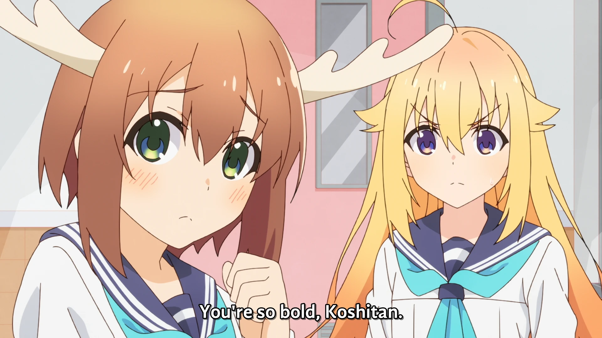

<h1 align='center'>Episode 1 - Girl Meets Deer</h1>

<table align='center'>
    <tr>
        <td colspan=2 align=center>  &nbsp https://youtu.be/z-4pdSmVqls </td>
    </tr>
    <tr>
        <td>  &nbsp<b>YouDeer:</b> https://nekocap.com/view/G4q8k75i7e </td>
        <td>  &nbsp<b>DeerGod:</b> https://nekocap.com/view/gqtpxteUdA </td>
    </tr>
</table>

<table align='center'>
    <tr>
        <!-- English (United States) -->
        <td><b>English (United States)</b></td>
        <!--  [[YouDeer] Shikanoko Nokonoko Koshitantan - 01 (WEB 1080p Dual Audio) | My Deer Friend Nokotan](https://nyaa.si/view/1844447)   -->
        <td><a href="https://nyaa.si/view/1844447">[YouDeer] Shikanoko Nokonoko Koshitantan - 01 (WEB 1080p Dual Audio) | My Deer Friend Nokotan</a></td>
    </tr>
    <tr>
        <!-- English (Canada) -->
        <td><b>English (Canada)</b></td>
        <!--  [[DeerGod] Shikanoko Nokonoko Koshitantan 01 (1080p) [60B3051A] (My Deer Friend Nokotan)](https://nyaa.si/view/1843981) -->
        <td><a href="https://nyaa.si/view/1843981">[DeerGod] Shikanoko Nokonoko Koshitantan 01 (1080p) [60B3051A] (My Deer Friend Nokotan)</a></td>
    </tr>
</table>

**Uploaded:** August 17, 2024  
**Last updated:** August 17, 2024

<!-- Description goes here -->

## Folder info

| File | Description |
| ---- | ----------- |
[`youdeer - 01.ass`](youdeer%20-%2001.ass) | English (United States) subtitle file |
[`deergod - 01.ass`](deergod%20-%2001.ass) | English (Canada) subtitle file |

## Font list

| Filename | Font name | NekoCap font? |
| ---- | ---- | :--: |
 [`AndikaBasic.ttf`](https://github.com/abrokecube/subtitles-fonts/tree/main/NekoCap%20fonts/AndikaBasic.ttf) | Andika Basic | ✔️ |
 [`ArtificeSSK.ttf`](https://github.com/abrokecube/subtitles-fonts/tree/main/NekoCap%20fonts/ArtificeSSK.ttf) | ArtificeSSK | ✔️ |
 [`BadaBoomProBB.ttf`](https://github.com/abrokecube/subtitles-fonts/tree/main/NekoCap%20fonts/BadaBoomProBB.ttf) | Bada Boom Pro BB | ✔️ |
 [`CCAstronautsInTrouble-Regular.ttf`](https://github.com/abrokecube/subtitles-fonts/tree/main/NekoCap%20fonts/CCAstronautsInTrouble-Regular.ttf) | CCAstronautsInTrouble-Regular | ✔️ |
 [`Comfortaa-700.ttf`](https://github.com/abrokecube/subtitles-fonts/tree/main/NekoCap%20fonts/Comfortaa-700.ttf) | Comfortaa Bold | ✔️ |
 [`Comfortaa-Regular.ttf`](https://github.com/abrokecube/subtitles-fonts/tree/main/NekoCap%20fonts/Comfortaa-Regular.ttf) | Comfortaa Regular | ✔️ |
 [`erasdus0.ttf`](https://github.com/abrokecube/subtitles-fonts/tree/main/NekoCap%20fonts/erasdus0.ttf) | EraserDust | ✔️ |
 [`GandhiSans-Bold.otf`](https://github.com/abrokecube/subtitles-fonts/tree/main/NekoCap%20fonts/GandhiSans-Bold.otf) | GandhiSans-Bold | ✔️ |
 [`GandhiSans-BoldItalic.otf`](https://github.com/abrokecube/subtitles-fonts/tree/main/NekoCap%20fonts/GandhiSans-BoldItalic.otf) | GandhiSans-BoldItalic | ✔️ |
 [`GenSekiGothicJP-R.ttf`](https://github.com/abrokecube/subtitles-fonts/tree/main/NekoCap%20fonts/GenSekiGothicJP-R.ttf) | GenSekiGothic JP R | ✔️ |
 [`Grain.ttf`](https://github.com/abrokecube/subtitles-fonts/tree/main/NekoCap%20fonts/Grain.ttf) | Grain Regular | ✔️ |
 [`Handgley-Regular.ttf`](https://github.com/abrokecube/subtitles-fonts/tree/main/NekoCap%20fonts/Handgley-Regular.ttf) | Handgley | ✔️ |
 [`HOT-Ninja-Std-R.ttf`](https://github.com/abrokecube/subtitles-fonts/tree/main/NekoCap%20fonts/HOT-Ninja-Std-R.ttf) | HOT-Ninja Std R | ✔️ |
 [`JasonHandwriting1.ttf`](https://github.com/abrokecube/subtitles-fonts/tree/main/NekoCap%20fonts/JasonHandwriting1.ttf) | JasonHandwriting1 Regular | ✔️ |
 [`MaplestoryBold.ttf`](https://github.com/abrokecube/subtitles-fonts/tree/main/NekoCap%20fonts/MaplestoryBold.ttf) | Maplestory Bold | ✔️ |
 [`MaplestoryLight.ttf`](https://github.com/abrokecube/subtitles-fonts/tree/main/NekoCap%20fonts/MaplestoryLight.ttf) | Maplestory Light | ✔️ |
 [`Open-Sans-700.ttf`](https://github.com/abrokecube/subtitles-fonts/tree/main/NekoCap%20fonts/Open-Sans-700.ttf) | Open Sans Bold | ✔️ |
 [`OpenSans-Regular.ttf`](https://github.com/abrokecube/subtitles-fonts/tree/main/NekoCap%20fonts/OpenSans-Regular.ttf) | Open Sans Regular | ✔️ |
 [`SourceSansPro-Regular.otf`](https://github.com/abrokecube/subtitles-fonts/tree/main/NekoCap%20fonts/SourceSansPro-Regular.otf) | SourceSansPro-Regular | ✔️ |
 [`Woodtexture.ttf`](./fonts/Woodtexture.ttf) | Woodtexture Regular | ❌ |

<!-- Permissions -->
## 
You are free to use these subtitles for whatever purpose. Please retain any credits listed in the subs. Credit to me is not required, but is appreciated.
