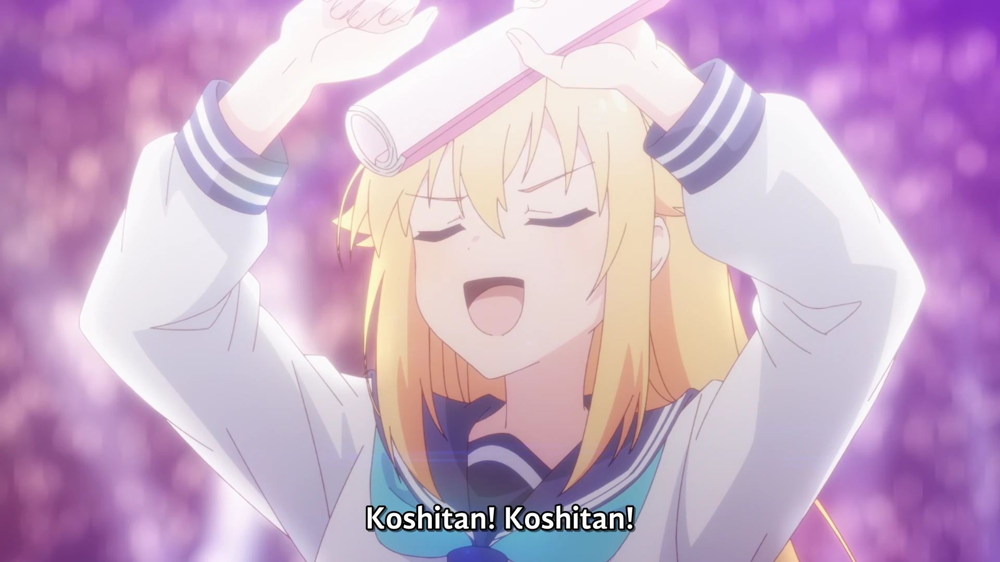

<h1 align='center'>Episode 3 - Bashame Enrolls</h1>

<table align='center'>
    <tr>
        <td colspan=2 align=center>  &nbsp https://youtu.be/VqiVoEot8b4 </td>
    </tr>
    <tr>
        <td>  &nbsp<b>YouDeer:</b> https://nekocap.com/view/WK8srHQSUY </td>
        <td>  &nbsp<b>DeerStalker:</b> https://nekocap.com/view/DVGhTRBZCP </td>
    </tr>
</table>

<table align='center'>
    <tr>
        <!-- English (United States) -->
        <td><b>English (United States)</b></td>
        <!--  [[YouDeer] Shikanoko Nokonoko Koshitantan - 03 (WEB 1080p Dual Audio) | My Deer Friend Nokotan](https://nyaa.si/view/1853037) -->
        <td><a href="https://nyaa.si/view/1853037">[YouDeer] Shikanoko Nokonoko Koshitantan - 03 (WEB 1080p Dual Audio) | My Deer Friend Nokotan</a></td>
    </tr>
    <tr>
        <!-- English (Canada) -->
        <td><b>English (Canada)</b></td>
        <!--  [[DeerStalker] Shikanoko Nokonoko Koshitantan | My Deer Friend Nokotan - S01E03 - [1080p][HEVC][AAC].mkv](https://nyaa.si/view/1848008) -->
        <td><a href="https://nyaa.si/view/1848008">[DeerStalker] Shikanoko Nokonoko Koshitantan | My Deer Friend Nokotan - S01E03 - [1080p][HEVC][AAC].mkv</a></td>
    </tr>
</table>

**Uploaded:** August 19, 2024  
**Last updated:** August 19, 2024

<!-- Description goes here -->

## Folder info

| File | Description |
| ---- | ----------- |
[`deerstalker - 3.ass`](deerstalker%20-%203.ass) | English (Canada) subtitle file |
[`youdeer - 3.ass`](youdeer%20-%203.ass) | English (United States) subtitle file |

## Font list

| Filename | Font name | NekoCap font? |
| ---- | ---- | :--: |
 [`ArtificeSSK.ttf`](https://github.com/abrokecube/subtitles-fonts/tree/main/NekoCap%20fonts/ArtificeSSK.ttf) | ArtificeSSK | ✔️ |
 [`Caveat-700.ttf`](https://github.com/abrokecube/subtitles-fonts/tree/main/NekoCap%20fonts/Caveat-700.ttf) | Caveat Bold | ✔️ |
 [`CCAstronautsInTrouble-Regular.ttf`](https://github.com/abrokecube/subtitles-fonts/tree/main/NekoCap%20fonts/CCAstronautsInTrouble-Regular.ttf) | CCAstronautsInTrouble-Regular | ✔️ |
 [`Chango-Regular.ttf`](https://github.com/abrokecube/subtitles-fonts/tree/main/NekoCap%20fonts/Chango-Regular.ttf) | Chango Regular | ✔️ |
 [`ClubTypeMercurius-Medium.ttf`](https://github.com/abrokecube/subtitles-fonts/tree/main/NekoCap%20fonts/ClubTypeMercurius-Medium.ttf) | ClubTypeMercurius-Medium | ✔️ |
 [`Comfortaa-700.ttf`](https://github.com/abrokecube/subtitles-fonts/tree/main/NekoCap%20fonts/Comfortaa-700.ttf) | Comfortaa Bold | ✔️ |
 [`Comfortaa-Regular.ttf`](https://github.com/abrokecube/subtitles-fonts/tree/main/NekoCap%20fonts/Comfortaa-Regular.ttf) | Comfortaa Regular | ✔️ |
 [`Fira-Sans-700.ttf`](https://github.com/abrokecube/subtitles-fonts/tree/main/NekoCap%20fonts/Fira-Sans-700.ttf) | Fira Sans Bold | ✔️ |
 [`GandhiSans-Bold.otf`](https://github.com/abrokecube/subtitles-fonts/tree/main/NekoCap%20fonts/GandhiSans-Bold.otf) | GandhiSans-Bold | ✔️ |
 [`GandhiSans-BoldItalic.otf`](https://github.com/abrokecube/subtitles-fonts/tree/main/NekoCap%20fonts/GandhiSans-BoldItalic.otf) | GandhiSans-BoldItalic | ✔️ |
 [`Handgley-Regular.ttf`](https://github.com/abrokecube/subtitles-fonts/tree/main/NekoCap%20fonts/Handgley-Regular.ttf) | Handgley | ✔️ |
 [`MaplestoryBold.ttf`](https://github.com/abrokecube/subtitles-fonts/tree/main/NekoCap%20fonts/MaplestoryBold.ttf) | Maplestory Bold | ✔️ |
 [`MaplestoryLight.ttf`](https://github.com/abrokecube/subtitles-fonts/tree/main/NekoCap%20fonts/MaplestoryLight.ttf) | Maplestory Light | ✔️ |
 [`Merriweather-Bold.otf`](https://github.com/abrokecube/subtitles-fonts/tree/main/NekoCap%20fonts/Merriweather-Bold.otf) | Merriweather Bold | ✔️ |
 [`OpenSans-Regular.ttf`](https://github.com/abrokecube/subtitles-fonts/tree/main/NekoCap%20fonts/OpenSans-Regular.ttf) | Open Sans Regular | ✔️ |
 [`PassingNotes.ttf`](https://github.com/abrokecube/subtitles-fonts/tree/main/NekoCap%20fonts/PassingNotes.ttf) | PassingNotes | ✔️ |
 [`SizableQuantity.ttf`](https://github.com/abrokecube/subtitles-fonts/tree/main/NekoCap%20fonts/SizableQuantity.ttf) | Sizable Quantity | ✔️ |

<!-- Permissions -->
## 
You are free to use these subtitles for whatever purpose. Please keep any credits listed in the subs. Credit is not required, but is appreciated.
