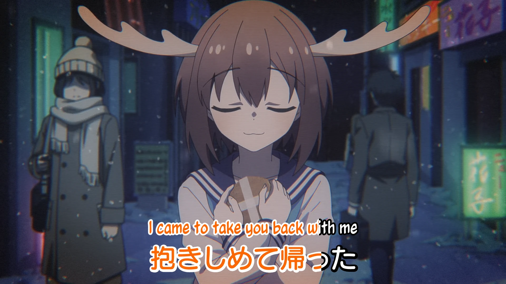

<h1 align='center'>Episode 04 - Deer Club Under Attack</h1>

<table align='center'>
    <tr>
        <td>  &nbsp <i>nowhere</i> </td>
        <td>  &nbsp <i>nah</i> </td>
    </tr>
</table>

<table align='center'>
    <tr>
        <!-- Subtitle source -->
        <td><b>Subtitle source</b></td>
        <!--  [[DeerStalker] Shikanoko Nokonoko Koshitantan | My Deer Friend Nokotan - S01E04 [1080p][HEVC][AAC]](https://nyaa.si/view/1851841) -->
        <td><a href="https://nyaa.si/view/1851841">[DeerStalker] Shikanoko Nokonoko Koshitantan | My Deer Friend Nokotan - S01E04 [1080p][HEVC][AAC]</a></td>
    </tr>
</table>

**Uploaded:** August 20, 2024  
**Last updated:** August 20, 2024

<!-- Description goes here -->
I finished this before realizing they didn't have anything past the first three episodes up for more than a week

## Folder info

| File | Description |
| ---- | ----------- |
[`deerstalker - 4.ass`](deerstalker%20-%204.ass) | Subtitle file |

## Font list

| Filename | Font name | NekoCap font? |
| ---- | ---- | :--: |
 [`Acme-Regular.ttf`](https://github.com/abrokecube/subtitles-fonts/tree/main/NekoCap%20fonts/Acme-Regular.ttf) | Acme Regular | ✔️ |
 [`Aller-Bold.ttf`](https://github.com/abrokecube/subtitles-fonts/tree/main/NekoCap%20fonts/Aller-Bold.ttf) | Aller Bold | ✔️ |
 [`BadaBoomProBB.ttf`](https://github.com/abrokecube/subtitles-fonts/tree/main/NekoCap%20fonts/BadaBoomProBB.ttf) | Bada Boom Pro BB | ✔️ |
 [`Caveat-700.ttf`](https://github.com/abrokecube/subtitles-fonts/tree/main/NekoCap%20fonts/Caveat-700.ttf) | Caveat Bold | ✔️ |
 [`CCAstronautsInTrouble-Regular.ttf`](https://github.com/abrokecube/subtitles-fonts/tree/main/NekoCap%20fonts/CCAstronautsInTrouble-Regular.ttf) | CCAstronautsInTrouble-Regular | ✔️ |
 [`Chango-Regular.ttf`](https://github.com/abrokecube/subtitles-fonts/tree/main/NekoCap%20fonts/Chango-Regular.ttf) | Chango Regular | ✔️ |
 [`ClubTypeMercurius-Medium.ttf`](https://github.com/abrokecube/subtitles-fonts/tree/main/NekoCap%20fonts/ClubTypeMercurius-Medium.ttf) | ClubTypeMercurius-Medium | ✔️ |
 [`Comfortaa-700.ttf`](https://github.com/abrokecube/subtitles-fonts/tree/main/NekoCap%20fonts/Comfortaa-700.ttf) | Comfortaa Bold | ✔️ |
 [`EB-Garamond-700.ttf`](https://github.com/abrokecube/subtitles-fonts/tree/main/NekoCap%20fonts/EB-Garamond-700.ttf) | EB Garamond Bold | ✔️ |
 [`GandhiSans-Bold.otf`](https://github.com/abrokecube/subtitles-fonts/tree/main/NekoCap%20fonts/GandhiSans-Bold.otf) | GandhiSans-Bold | ✔️ |
 [`GandhiSans-BoldItalic.otf`](https://github.com/abrokecube/subtitles-fonts/tree/main/NekoCap%20fonts/GandhiSans-BoldItalic.otf) | GandhiSans-BoldItalic | ✔️ |
 [`Handgley-Regular.ttf`](https://github.com/abrokecube/subtitles-fonts/tree/main/NekoCap%20fonts/Handgley-Regular.ttf) | Handgley | ✔️ |
 [`MaplestoryBold.ttf`](https://github.com/abrokecube/subtitles-fonts/tree/main/NekoCap%20fonts/MaplestoryBold.ttf) | Maplestory Bold | ✔️ |
 [`MaplestoryLight.ttf`](https://github.com/abrokecube/subtitles-fonts/tree/main/NekoCap%20fonts/MaplestoryLight.ttf) | Maplestory Light | ✔️ |
 [`Merriweather-Bold.otf`](https://github.com/abrokecube/subtitles-fonts/tree/main/NekoCap%20fonts/Merriweather-Bold.otf) | Merriweather Bold | ✔️ |
 [`Merriweather-Regular.ttf`](https://github.com/abrokecube/subtitles-fonts/tree/main/NekoCap%20fonts/Merriweather-Regular.ttf) | Merriweather Regular | ✔️ |
 [`Misfits.ttf`](https://github.com/abrokecube/subtitles-fonts/tree/main/NekoCap%20fonts/Misfits.ttf) | Misfits | ✔️ |
 [`Mops.ttf`](https://github.com/abrokecube/subtitles-fonts/tree/main/NekoCap%20fonts/Mops.ttf) | Mops Antiqua | ✔️ |
 [`Open-Sans-700.ttf`](https://github.com/abrokecube/subtitles-fonts/tree/main/NekoCap%20fonts/Open-Sans-700.ttf) | Open Sans Bold | ✔️ |
 [`OpenSans-Regular.ttf`](https://github.com/abrokecube/subtitles-fonts/tree/main/NekoCap%20fonts/OpenSans-Regular.ttf) | Open Sans Regular | ✔️ |
 [`PassingNotes.ttf`](https://github.com/abrokecube/subtitles-fonts/tree/main/NekoCap%20fonts/PassingNotes.ttf) | PassingNotes | ✔️ |
 [`Poppins-Regular.ttf`](https://github.com/abrokecube/subtitles-fonts/tree/main/NekoCap%20fonts/Poppins-Regular.ttf) | Poppins Regular | ✔️ |
 [`Roboto-Regular.ttf`](https://github.com/abrokecube/subtitles-fonts/tree/main/NekoCap%20fonts/Roboto-Regular.ttf) | Roboto | ✔️ |
 [`SizableQuantity.ttf`](https://github.com/abrokecube/subtitles-fonts/tree/main/NekoCap%20fonts/SizableQuantity.ttf) | Sizable Quantity | ✔️ |
 [`SourceSansPro-Bold.otf`](https://github.com/abrokecube/subtitles-fonts/tree/main/NekoCap%20fonts/SourceSansPro-Bold.otf) | SourceSansPro-Bold | ✔️ |
 [`SSPretzel-Regular.ttf`](https://github.com/abrokecube/subtitles-fonts/tree/main/NekoCap%20fonts/SSPretzel-Regular.ttf) | SSPretzel-Regular | ✔️ |
 [`SugarDeath2.ttf`](https://github.com/abrokecube/subtitles-fonts/tree/main/NekoCap%20fonts/SugarDeath2.ttf) | Sugar Death 2 | ✔️ |

<!-- Permissions -->
## 
You are free to use these subtitles for whatever purpose. Please retain any credits listed in the subs. Credit to me is not required, but is appriciated.
