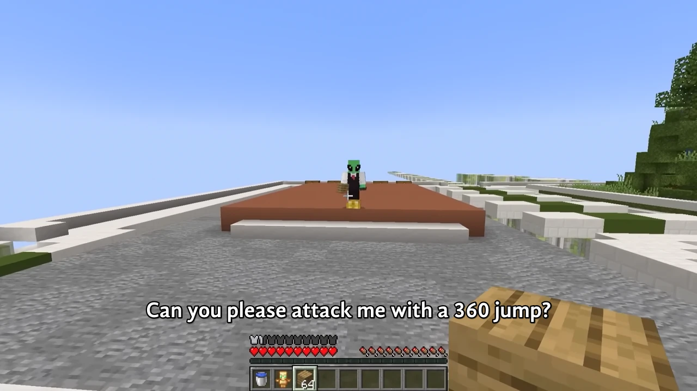

<h1 align='center'>Parkour Civilization 2</h1>

<table align='center'>
    <tr>
        <td>  &nbsp https://youtu.be/DIzzMDDncnE </td>
        <td>  &nbsp https://nekocap.com/view/vlXIfMWmPt </td>
    </tr>
</table>

<table align='center'>
</table>

**Uploaded:** October 11, 2024  
**Last updated:** October 11, 2024

<!-- Description goes here -->
I am *soooo* unfunny

Script created using Whisper transcription as a base. Timed from scratch.  
Includes episode start titles and a recap timer for easier skipping.  
Vine booms are also subbed because yes  
May contain transcription mistakes (i was speedrunning this)

## Folder info

| File | Description |
| ---- | ----------- |
[`parkour civilization 2.ass`](parkour%20civilization%202.ass) | Subtitle file |
[`parkour civilization 2.srt`](parkour%20civilization%202.srt) | Subtitle file without styling |
[`parkour civilization 2.txt`](parkour%20civilization%202.txt) | Untimed text |

## Font list

| Filename | Font name | NekoCap font? |
| ---- | ---- | :--: |
 [`GandhiSans-Bold.otf`](https://github.com/abrokecube/subtitles-fonts/tree/main/NekoCap%20fonts/GandhiSans-Bold.otf) | GandhiSans-Bold | ✔️ |
 [`GandhiSans-BoldItalic.otf`](https://github.com/abrokecube/subtitles-fonts/tree/main/NekoCap%20fonts/GandhiSans-BoldItalic.otf) | GandhiSans-BoldItalic | ✔️ |
 [`Overpass-700.ttf`](https://github.com/abrokecube/subtitles-fonts/tree/main/NekoCap%20fonts/Overpass-700.ttf) | Overpass Bold | ✔️ |
 [`Overpass-Regular.ttf`](https://github.com/abrokecube/subtitles-fonts/tree/main/NekoCap%20fonts/Overpass-Regular.ttf) | Overpass Regular | ✔️ |

<!-- Permissions -->
## 
You are free to use these subtitles for whatever purpose. Please keep any credits listed in the subs. Credit is not required, but is appreciated.
