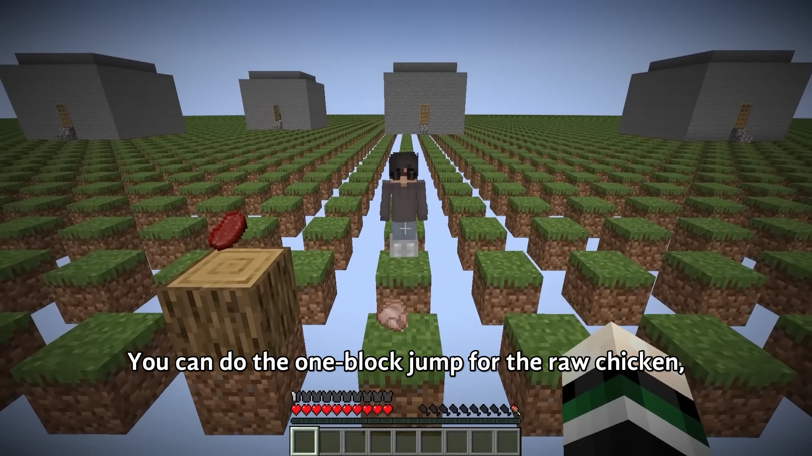

<h1 align='center'>Minecraft but I survive in PARKOUR CIVILIZATION</h1>

<table align='center'>
    <tr>
        <td>  &nbsp https://youtu.be/2pFwQiwRbcg </td>
        <td>  &nbsp https://nekocap.com/view/9IAhGipK9v </td>
    </tr>
</table>

...or you can attempt the one-block vertical jump for the beef.

**Uploaded:** October 07, 2024  
**Last updated:** October 07, 2024

<!-- Description goes here -->
I did this for the meme

Script created using Whisper transcription as a base. Timed from scratch.  
Includes episode start titles and a recap timer for easier skipping.  
Vine booms are also subbed because yes

## Folder info

| File | Description |
| ---- | ----------- |
[`parkour civilization s1.ass`](parkour%20civilization%20s1.ass) | Subtitle file |
[`parkour civilization.srt`](parkour%20civilization.srt) | Subtitle file without styling |
[`parkour civilization.txt`](parkour%20civilization.txt) | Untimed text |

## Font list

| Filename | Font name | NekoCap font? |
| ---- | ---- | :--: |
 [`GandhiSans-Bold.otf`](https://github.com/abrokecube/subtitles-fonts/tree/main/NekoCap%20fonts/GandhiSans-Bold.otf) | GandhiSans-Bold | ✔️ |
 [`GandhiSans-BoldItalic.otf`](https://github.com/abrokecube/subtitles-fonts/tree/main/NekoCap%20fonts/GandhiSans-BoldItalic.otf) | GandhiSans-BoldItalic | ✔️ |
 [`Overpass-700.ttf`](https://github.com/abrokecube/subtitles-fonts/tree/main/NekoCap%20fonts/Overpass-700.ttf) | Overpass Bold | ✔️ |
 [`Overpass-Regular.ttf`](https://github.com/abrokecube/subtitles-fonts/tree/main/NekoCap%20fonts/Overpass-Regular.ttf) | Overpass Regular | ✔️ |

<!-- Permissions -->
## 
You are free to use these subtitles for whatever purpose. Credit is not required, but is appriciated.
