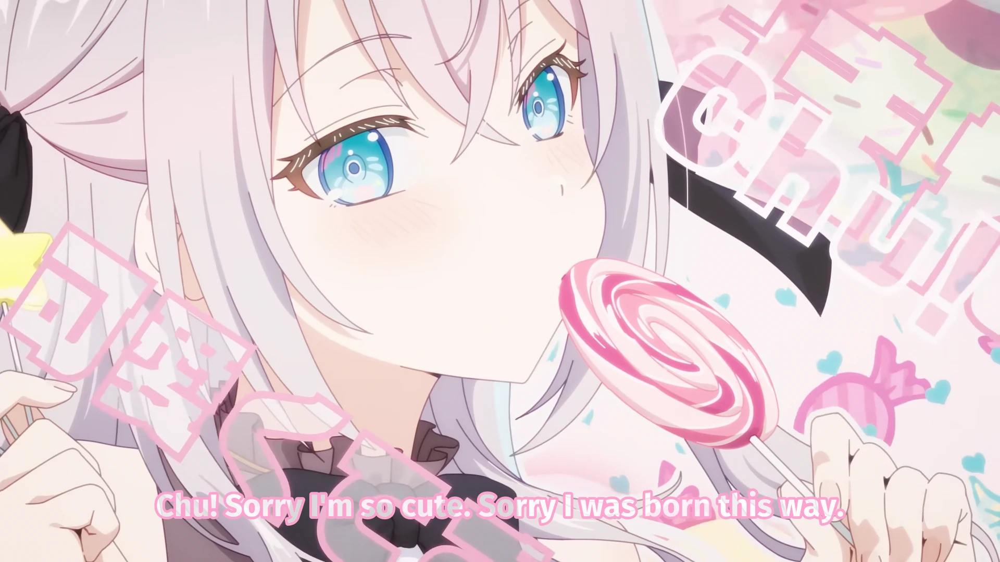

<h1 align='center'>Roshidere Episode 2 ED - Kawaikute gomen</h1>

<table align='center'>
    <tr>
        <td>  &nbsp https://youtu.be/O9S2bWkaiMI </td>
        <td>  &nbsp https://nekocap.com/view/K7S0ajzHRS </td>
    </tr>
</table>

<table align='center'>
    <tr>
        <!-- Translation -->
        <td><b>Subtitle source</b></td>
        <!--  [[Chihiro] Tokidoki Bosotto Russia-go de Dereru Tonari no Alya-san - 02 [1080p Hi10P AAC][09BFAE04].mkv](https://nyaa.si/view/1847496) -->
        <td><a href="https://nyaa.si/view/1847496">[Chihiro] Tokidoki Bosotto Russia-go de Dereru Tonari no Alya-san - 02 [1080p Hi10P AAC][09BFAE04].mkv</a></td>
    </tr>
</table>

**Uploaded:** July 31, 2024  
**Last updated:** July 31, 2024

<!-- Description goes here -->

## Folder info

| File | Description |
| ---- | ----------- |
[`Roshidere ep2 ed kawaikute gomen.ass`](Roshidere%20ep2%20ed%20kawaikute%20gomen.ass) | Subtitle file |

## Font list

| Filename | Font name | NekoCap font? |
| ---- | ---- | :--: |
 [`Comfortaa-700.ttf`](https://github.com/abrokecube/subtitles-fonts/tree/main/NekoCap%20fonts/Comfortaa-700.ttf) | Comfortaa Bold | ✔️ |
 [`Fira-Sans-700.ttf`](https://github.com/abrokecube/subtitles-fonts/tree/main/NekoCap%20fonts/Fira-Sans-700.ttf) | Fira Sans Bold | ✔️ |

<!-- Permissions -->
## 
You are free to use these subtitles for whatever purpose. Please keep any credits listed in the subs. Credit is not required, but is appreciated.
