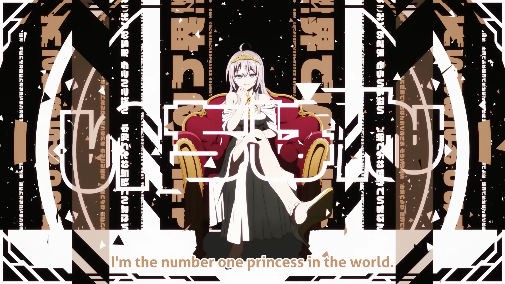

<h1 align='center'>Roshidere Episode 9 ED - World is Mine</h1>

<table align='center'>
    <tr>
        <td>  &nbsp https://youtu.be/HrHPgipTDAU </td>
        <td>  &nbsp https://nekocap.com/view/134fFWwwZM </td>
    </tr>
</table>

<table align='center'>
    <tr>
        <!-- Translation -->
        <td><b>Translation</b></td>
        <!--  [[Chihiro] Tokidoki Bosotto Russia-go de Dereru Tonari no Alya-san - 09 [1080p Hi10P AAC][0FA6AD0B].mkv](https://nyaa.si/view/1871480) -->
        <td><a href="https://nyaa.si/view/1871480">[Chihiro] Tokidoki Bosotto Russia-go de Dereru Tonari no Alya-san - 09 [1080p Hi10P AAC][0FA6AD0B].mkv</a></td>
    </tr>
</table>

**Uploaded:** September 10, 2024  
**Last updated:** September 10, 2024

<!-- Description goes here -->
sekaaaaAAAAAAaai de

## Folder info

| File | Description |
| ---- | ----------- |
[`World is Mine.ass`](World%20is%20Mine.ass) | Subtitle file |

## Font list

| Filename | Font name | NekoCap font? |
| ---- | ---- | :--: |
 [`Aller-Bold.ttf`](https://github.com/abrokecube/subtitles-fonts/tree/main/NekoCap%20fonts/Aller-Bold.ttf) | Aller Bold | ✔️ |
 [`Comfortaa-700.ttf`](https://github.com/abrokecube/subtitles-fonts/tree/main/NekoCap%20fonts/Comfortaa-700.ttf) | Comfortaa Bold | ✔️ |

<!-- Permissions -->
## 
You are free to use these subtitles for whatever purpose. Credit is not required, but is appriciated.
