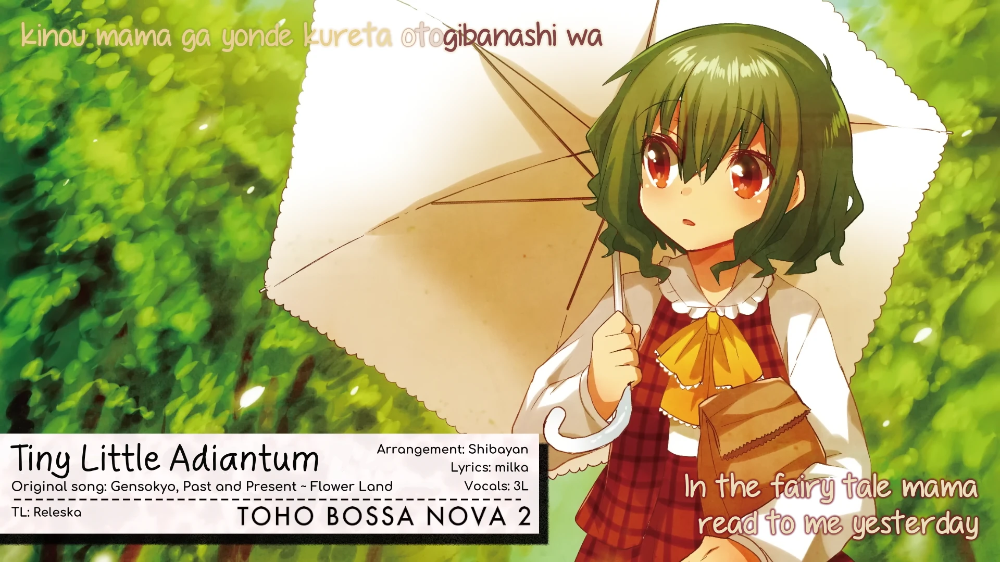

<h1 align='center'>ShibayanRecords - Tiny Little Adiantum</h1>

<table align='center'>
    <tr>
        <td>  &nbsp https://youtu.be/rB7XFQgJHBI </td>
        <td>  &nbsp https://nekocap.com/view/sokdrW8L5q </td>
    </tr>
</table>

<table align='center'>
    <tr>
        <!-- Translation -->
        <td><b>Translation</b></td>
        <!--  Releska (YouTube captions) -->
        <td>Releska (YouTube captions)</td>
    </tr>
</table>

**Uploaded:** July 28, 2024  
**Last updated:** July 29, 2024

<!-- Description goes here -->

## Folder info

| File | Description |
| ---- | ----------- |
[`Tiny Little Adiantum.ass`](Tiny%20Little%20Adiantum.ass) | Subtitle file |

## Font list

| Filename | Font name | NekoCap font? |
| ---- | ---- | :--: |
 [`Comfortaa-700.ttf`](https://github.com/abrokecube/subtitles-fonts/tree/main/NekoCap%20fonts/Comfortaa-700.ttf) | Comfortaa Bold | ✔️ |
 [`Comfortaa-Regular.ttf`](https://github.com/abrokecube/subtitles-fonts/tree/main/NekoCap%20fonts/Comfortaa-Regular.ttf) | Comfortaa Regular | ✔️ |
 [`Handgley-Regular.ttf`](https://github.com/abrokecube/subtitles-fonts/tree/main/NekoCap%20fonts/Handgley-Regular.ttf) | Handgley | ✔️ |
 [`PassingNotes.ttf`](https://github.com/abrokecube/subtitles-fonts/tree/main/NekoCap%20fonts/PassingNotes.ttf) | PassingNotes | ✔️ |

<!-- Permissions -->
## 
You are free to use these subtitles for whatever purpose. Please keep any credits listed in the subs. Credit is not required, but is appreciated.
