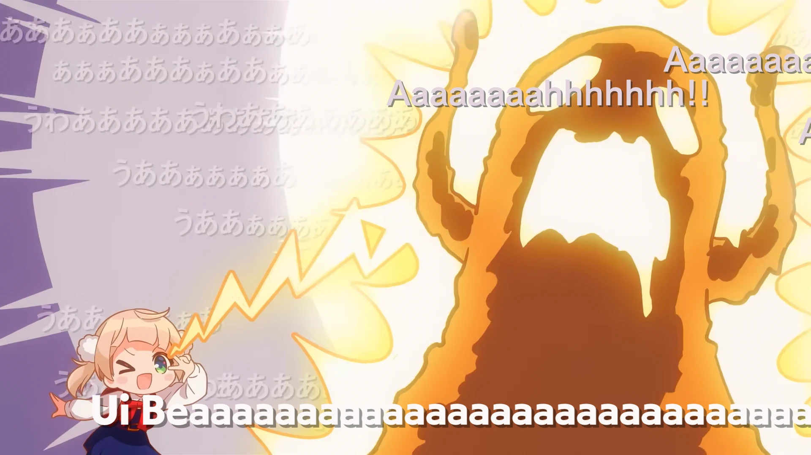

<h1 align='center'>Shigure Ui - Shukusei!! Loli Kami Requiem</h1>

<table align='center'>
    <tr>
        <td>  &nbsp https://youtu.be/Ci_zad39Uhw </td>
        <td>  &nbsp https://nekocap.com/view/xg7gvrQ1JK </td>
    </tr>
</table>

<table align='center'>
    <tr>
        <!-- Lyrics Translation -->
        <td><b>Lyrics Translation</b></td>
        <!--  [Thae(rin) @ Lyrical Nonsense](https://www.lyrical-nonsense.com/global/lyrics/shigure-ui/shukusei-lorikami-requiem/english/) -->
        <td><a href="https://www.lyrical-nonsense.com/global/lyrics/shigure-ui/shukusei-lorikami-requiem/english/">Thae(rin) @ Lyrical Nonsense</a></td>
    </tr>
</table>

**Uploaded:** October 16, 2024  
**Last updated:** October 16, 2024

<!-- Description goes here -->

## Folder info

| File | Description |
| ---- | ----------- |
[`loli kami.ass`](loli%20kami.ass) | Subtitle file |
[`paster.py`](paster.py) | Copies tags |
[`randtiming.py`](randtiming.py) | Shuffles event times |
[`snaptimes.py`](snaptimes.py) | Set all \t to 1ms duration |

## Font list

| Filename | Font name | NekoCap font? |
| ---- | ---- | :--: |
 [`FOT-CezanneProN-DB.otf`](./fonts/FOT-CezanneProN-DB.otf) | CezanneProN-DB | ❌ |
 [`FOT-MatisseProN-B.otf`](./fonts/FOT-MatisseProN-B.otf) | MatisseProN-B | ❌ |
 [`FOT-RodinPro-EB.otf`](./fonts/FOT-RodinPro-EB.otf) | RodinPro-EB | ❌ |
 [`FOT-UDKakugo_LargePr6N-B.otf`](./fonts/FOT-UDKakugo_LargePr6N-B.otf) | UDKakugo_LargePr6N-B | ❌ |
 [`FOT-UDKakugo_LargePr6N-U.otf`](./fonts/FOT-UDKakugo_LargePr6N-U.otf) | UDKakugo_LargePr6N-U | ❌ |
 [`pandabakery.ttf`](./fonts/pandabakery.ttf) | panda bakery | ❌ |

<!-- Permissions -->
## 
You are free to use these subtitles for whatever purpose. Please keep any credits listed in the subs. Credit is not required, but is appreciated.
