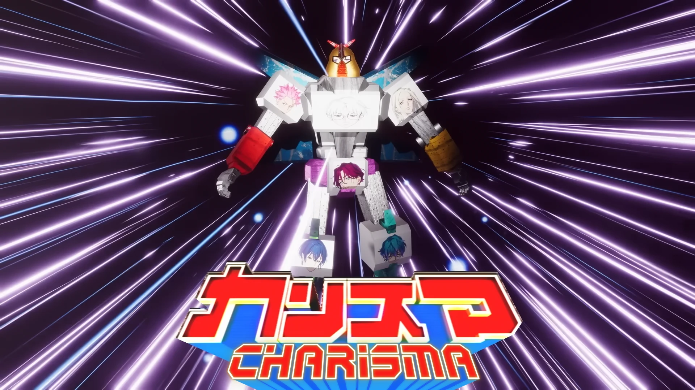

<h1 align='center'>The Seven Charismas - Charisma Picnic</h1>

<table align='center'>
    <tr>
        <td>  &nbsp https://youtu.be/V8tzcj14CeQ </td>
        <td>  &nbsp https://nekocap.com/view/GMIOcda1XL </td>
    </tr>
</table>
<table align='center'>
    <tr>
        <td><b>Hardsub</b></td>
        <td>https://youtu.be/wDAnn8djveI</td>
    </tr>
</table>

<table align='center'>
    <tr>
        <!-- Translation -->
        <td><b>Lyrics translation</b></td>
        <!--  [dokujirai](https://www.tumblr.com/dokujirai/711824794993197056/charisma-the-seven-charismas-charisma) -->
        <td><a href="https://www.tumblr.com/dokujirai/711824794993197056/charisma-the-seven-charismas-charisma">dokujirai</a></td>
    </tr>
    <tr>
        <!-- Other translations -->
        <td><b>Other translations</b></td>
        <!-- Machine translation -->
        <td>Google Translate, DeepL, GPT-4o, and Claude 3.5 Sonnet</td>
    </tr>

</table>

**Uploaded:** August 15, 2024  
**Last updated:** August 15, 2024

<!-- Description goes here -->
very epic subs (17.5k lines)  
idk if any of the machine translated stuff is corrent lmao

## Folder info

| File | Description |
| ---- | ----------- |
[`charisma picnic.ass`](charisma%20picnic.ass) | File with no optimizations |
[`charisma picnic_opt.ass`](charisma%20picnic_opt.ass) | File after optimizations (simplified shapes + asswipe) |
[`charisma picnic_opt_nodata.ass`](charisma%20picnic_opt_nodata.ass) | Exported file with removed extradata |

## Font list

| Filename | Font name | NekoCap font? |
| ---- | ---- | :--: |
 [`Acme-Regular-Outline.ttf`](./fonts/Acme-Regular-Outline.ttf) | Acme Regular Outline | ❌ |
 [`Acme-Regular.ttf`](https://github.com/abrokecube/subtitles-fonts/tree/main/NekoCap%20fonts/Acme-Regular.ttf) | Acme Regular | ✔️ |
 [`Bakbak One-Regular.ttf`](./fonts/Bakbak%20One-Regular.ttf) | Bakbak One Regular | ❌ |
 [`CCAstronautsInTrouble-Regular.ttf`](https://github.com/abrokecube/subtitles-fonts/tree/main/NekoCap%20fonts/CCAstronautsInTrouble-Regular.ttf) | CCAstronautsInTrouble-Regular | ✔️ |
 [`ClubTypeMercurius-Medium.ttf`](https://github.com/abrokecube/subtitles-fonts/tree/main/NekoCap%20fonts/ClubTypeMercurius-Medium.ttf) | ClubTypeMercurius-Medium | ✔️ |
 [`EB-Garamond-Regular.ttf`](https://github.com/abrokecube/subtitles-fonts/tree/main/NekoCap%20fonts/EB-Garamond-Regular.ttf) | EB Garamond Regular | ✔️ |
 [`erasdus0.ttf`](https://github.com/abrokecube/subtitles-fonts/tree/main/NekoCap%20fonts/erasdus0.ttf) | EraserDust | ✔️ |
 [`Fira-Sans-700.ttf`](https://github.com/abrokecube/subtitles-fonts/tree/main/NekoCap%20fonts/Fira-Sans-700.ttf) | Fira Sans Bold | ✔️ |
 [`NeuePixelSans.ttf`](./fonts/NeuePixelSans.ttf) | Neue Pixel Sans | ❌ |
 [`Overpass-Regular.ttf`](https://github.com/abrokecube/subtitles-fonts/tree/main/NekoCap%20fonts/Overpass-Regular.ttf) | Overpass Regular | ✔️ |
 [`PassingNotes.ttf`](https://github.com/abrokecube/subtitles-fonts/tree/main/NekoCap%20fonts/PassingNotes.ttf) | PassingNotes | ✔️ |
 [`Roboto-Regular.ttf`](https://github.com/abrokecube/subtitles-fonts/tree/main/NekoCap%20fonts/Roboto-Regular.ttf) | Roboto | ✔️ |
 [`Sarabun-Regular.ttf`](https://github.com/abrokecube/subtitles-fonts/tree/main/NekoCap%20fonts/Sarabun-Regular.ttf) | Sarabun Regular | ✔️ |
 [`SizableQuantity.ttf`](https://github.com/abrokecube/subtitles-fonts/tree/main/NekoCap%20fonts/SizableQuantity.ttf) | Sizable Quantity | ✔️ |
 [`SSPretzel-Regular.ttf`](https://github.com/abrokecube/subtitles-fonts/tree/main/NekoCap%20fonts/SSPretzel-Regular.ttf) | SSPretzel-Regular | ✔️ |

<!-- Permissions -->
## 
You are free to use these subtitles for whatever purpose. Credit is not required, but is appriciated.
