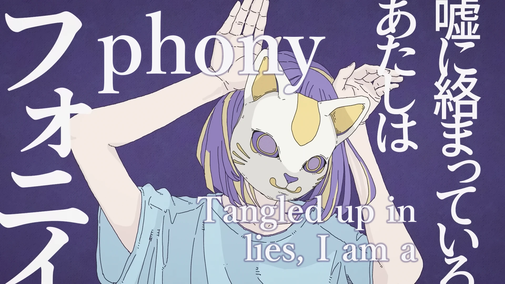

<h1 align='center'>Tsumiki - phony</h1>

<table align='center'>
    <tr>
        <td>  &nbsp https://youtu.be/9QLT1Aw_45s </td>
        <td>  &nbsp https://nekocap.com/view/2h2nWaUpvW </td>
    </tr>
</table>

[](https://www.youtube.com/watch?v=9QLT1Aw_45s&nekocap=2h2nWaUpvW)

<table align='center'>
    <tr>
        <!-- Translation -->
        <td><b>Translation</b></td>
        <!--  Pupleon via [Vocaloid Lyrics Wiki](https://vocaloidlyrics.fandom.com/wiki/%E3%83%95%E3%82%A9%E3%83%8B%E3%82%A4_(phony)) -->
        <td>Pupleon via <a href="https://vocaloidlyrics.fandom.com/wiki/%E3%83%95%E3%82%A9%E3%83%8B%E3%82%A4_(phony)">Vocaloid Lyrics Wiki</a></td>
    </tr>
    <tr>
        <!-- Also see -->
        <td><b>Also see</b></td>
        <!--  [AngelSubs reprint](https://www.youtube.com/watch?v=_5ptpq9BxEM) -->
        <td><a href="https://www.youtube.com/watch?v=_5ptpq9BxEM">AngelSubs reprint</a></td>
    </tr>
</table>

**Uploaded:** September 29, 2024  
**Last updated:** September 29, 2024

<!-- Description goes here -->
needs more blur

## Folder info

| File | Description |
| ---- | ----------- |
[`kafu - phony.ass`](kafu%20-%20phony.ass) | Subtitle file |
[`dupli-blur.lua`](dupli-blur.lua) | ([Luainterpret](https://typesettingtools.github.io/depctrl-browser/macros/lyger.LuaInterpret/)) Blur using duplicate lines at differing opacities |
[`simple_infinite_yblur.lua`](simple_infinite_yblur.lua) | (Luainterpret) Infinite y blur effect using big \ybord |
[`complex_infinite_blur.lua`](complex_infinite_blur.lua) | (Luainterpret) Infinite y blur effect - to be used with [Shapery](https://typesettingtools.github.io/depctrl-browser/macros/ILL.Shapery/)|
[`pixelize.py`](pixelize.py) | Pixel mosaic effect using image capture and line with rect clip - uses [fansubBlock.ttf](./fonts/fansubBlock.ttf) |

### Test


### dupli-blur

I used 5-7 samples in the subtitle
```lua
SAMPLES = 20
BLUR_AMNT = 50
ALPHA_MULT = .5
NORMALIZE = true
```

### pixelize


```python
# Dialogue: 0,0:00:00.00,0:00:05.00,Sign,,0,0,0,,{\fs350\fnYu Mincho Demibold\clip(110.35,86.4,751.65,379.2)}Test
SCALE_NEAREST = False
# Block width: 30
# Block height: 20
```

### simple_infinite_yblur


with `\4a&HD0&`

### complex_infinite_blur

```lua
SAMPLES = 10
REAL_BLUR_AMNT = 3
```
I only used one sample in the subtitle to reduce lag   
I set my samples to 5 and then deleted the 1st, 2nd, 4th, and 5th lines


## Font list

| Filename | Font name | NekoCap font? |
| ---- | ---- | :--: |
 [`arial.ttf`](./fonts/arial.ttf) | Arial | ❌ |
 [`fansubBlock.ttf`](./fonts/fansubBlock.ttf) | Fansub Block | ❌ |
 [`yumindb.ttf`](./fonts/yumindb.ttf) | Yu Mincho Demibold | ❌ |

fansub block in 2024 wow

<!-- Permissions -->
## 
You are free to use these subtitles for whatever purpose. Credit is not required, but is appriciated.
