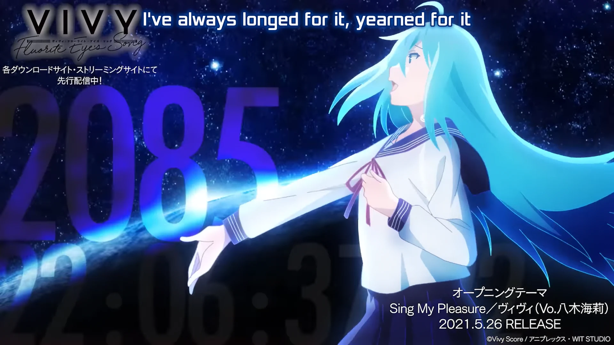

<h1 align='center'>Vivy: Flourite Eye's Song OP - Sing My Pleasure</h1>

<table align='center'>
    <tr>
        <td>  &nbsp https://youtu.be/2p8ig-TrYPY </td>
        <td>  &nbsp https://nekocap.com/view/8JcU6GbP0b </td>
    </tr>
</table>

<table align='center'>
    <tr>
        <!-- Source -->
        <td><b>Source</b></td>
        <!--  [[YameteTomete] Vivy - Fluorite Eye's Song - 04 [C661F115].mkv](https://nyaa.si/view/1377372) -->
        <td><a href="https://nyaa.si/view/1377372">[YameteTomete] Vivy - Fluorite Eye's Song - 04 [C661F115].mkv</a></td>
    </tr>
</table>

**Uploaded:** October 19, 2024  
**Last updated:** October 19, 2024

<!-- Description goes here -->

## Folder info

| File | Description |
| ---- | ----------- |
[`sing my pleasure.ass`](sing%20my%20pleasure.ass) | Subtitle file |

## Font list

| Filename | Font name | NekoCap font? |
| ---- | ---- | :--: |
 [`Poppins-Regular.ttf`](https://github.com/abrokecube/subtitles-fonts/tree/main/NekoCap%20fonts/Poppins-Regular.ttf) | Poppins Regular | ✔️ |
 [`Xolonium.ttf`](./fonts/Xolonium.ttf) | Xolonium-Bold | ❌ |

<!-- Permissions -->
## 
You are free to use these subtitles for whatever purpose. Credit is not required, but is appriciated.
