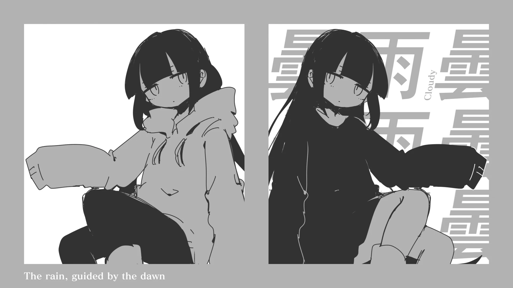

<h1 align='center'>inabakumori - I'm the Rain</h1>

<table align='center'>
    <tr>
        <td>  &nbsp https://youtu.be/EEk4JGzqoFg </td>
        <td>  &nbsp https://nekocap.com/view/MzVFbHxH9V </td>
    </tr>
</table>

<table align='center'>
    <tr>
        <!-- Translation -->
        <td><b>Translation</b></td>
        <!--  JaysAndRavens47, with edits by Thai1210 via [Vocaloid Lyrics Wiki](https://vocaloidlyrics.fandom.com/wiki/%E7%A7%81%E3%81%AF%E9%9B%A8_(Watashi_wa_Ame)) -->
        <td>JaysAndRavens47, with edits by Thai1210 via <a href="https://vocaloidlyrics.fandom.com/wiki/%E7%A7%81%E3%81%AF%E9%9B%A8_(Watashi_wa_Ame)">Vocaloid Lyrics Wiki</a></td>
    </tr>
    <tr>
        <!-- Other translations -->
        <td><b>Other translations</b></td>
        <!--  ChatGPT-4o -->
        <td>ChatGPT-4o</td>
    </tr>
</table>

**Uploaded:** October 05, 2024  
**Last updated:** October 05, 2024

<!-- Description goes here -->

## Folder info

| File | Description |
| ---- | ----------- |
[`inabakumori - i'm the rain.ass`](inabakumori%20-%20i%27m%20the%20rain.ass) | Subtitle file |

## Font list

| Filename | Font name | NekoCap font? |
| ---- | ---- | :--: |
 [`FOT-MatisseProN-B.otf`](./fonts/FOT-MatisseProN-B.otf) | MatisseProN-B | ❌ |

<!-- Permissions -->
## 
You are free to use these subtitles for whatever purpose. Credit is not required, but is appriciated.
