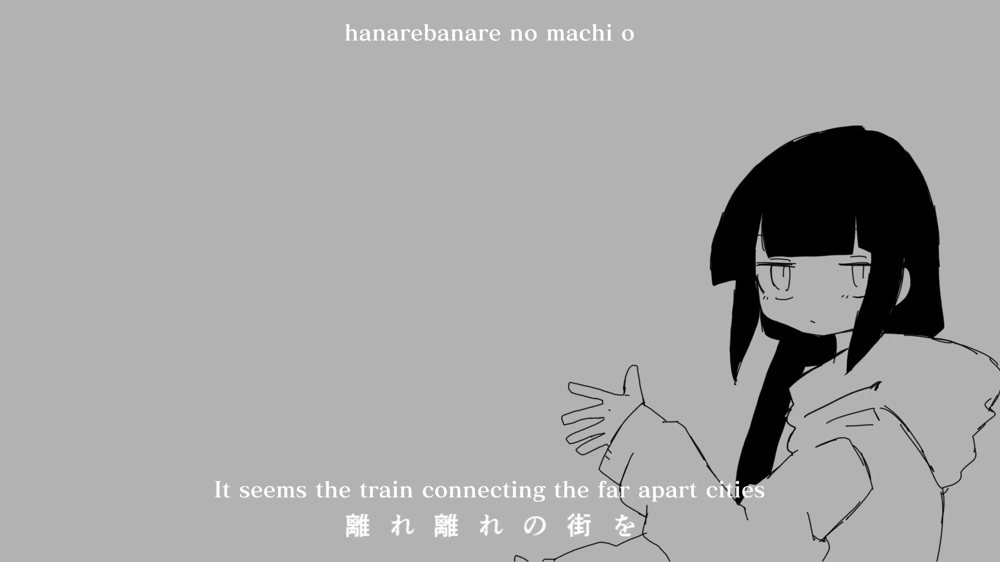

<h1 align='center'>inabakumori - Lagtrain</h1>

<table align='center'>
    <tr>
        <td>  &nbsp https://youtu.be/UnIhRpIT7nc </td>
        <td>  &nbsp https://nekocap.com/view/oTvFTE9EgF </td>
    </tr>
</table>

<table align='center'>
    <tr>
        <!-- Translation -->
        <td><b>Translation</b></td>
        <!--  AngelSubs (via [Vocaloid Lyrics Wiki](https://vocaloidlyrics.miraheze.org/wiki/%E3%83%A9%E3%82%B0%E3%83%88%E3%83%AC%E3%82%A4%E3%83%B3_(Lagtrain))) -->
        <td>AngelSubs (via <a href="https://vocaloidlyrics.miraheze.org/wiki/%E3%83%A9%E3%82%B0%E3%83%88%E3%83%AC%E3%82%A4%E3%83%B3_(Lagtrain)">Vocaloid Lyrics Wiki</a>)</td>
    </tr>
</table>

**Uploaded:** September 18, 2024  
**Last updated:** September 18, 2024

<!-- Description goes here -->
when the train is lag

## Folder info

| File | Description |
| ---- | ----------- |
[`lagtrain.ass`](lagtrain.ass) | Subtitle file |

## Font list

| Filename | Font name | NekoCap font? |
| ---- | ---- | :--: |
 [`FOT-MatisseProN-B.otf`](./fonts/FOT-MatisseProN-B.otf) | MatisseProN-B | ❌ |

##
You are free to use these subtitles for whatever purpose. Please retain any credits listed in the subs. Credit to me is not required, but is appreciated.
