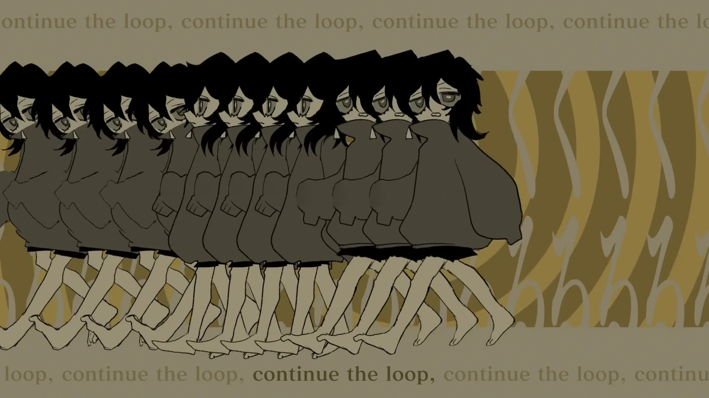

<h1 align='center'>rusino - Looping the Rooms feat. Hatsune Miku</h1>

<table align='center'>
    <tr>
        <td>  &nbsp https://youtu.be/icBDYkfxpMs </td>
        <td>  &nbsp https://nekocap.com/view/HrQIRLxYhr </td>
    </tr>
</table>

    

<table align='center'>
    <tr>
        <!-- English translation -->
        <td><b>English translation</b></td>
        <!--  HEARTMUSH, with edits by Violet ([Vocaloid Lyrics Wiki](https://vocaloidlyrics.miraheze.org/wiki/%E3%83%AB%E3%83%BC%E3%83%97%E3%82%B6%E3%83%AB%E3%83%BC%E3%83%A0_(Loop_the_Room))) -->
        <td>HEARTMUSH, with edits by Violet (<a href="https://vocaloidlyrics.miraheze.org/wiki/%E3%83%AB%E3%83%BC%E3%83%97%E3%82%B6%E3%83%AB%E3%83%BC%E3%83%A0_(Loop_the_Room)">Vocaloid Lyrics Wiki</a>)</td>
    </tr>
</table>

**Uploaded:** February 24, 2026  
**Last updated:** February 24, 2026

<!-- Description goes here -->

## Folder info

| File | Description |
| ---- | ----------- |
[`looping the rooms.ass`](looping%20the%20rooms.ass) | Subtitle file |

## Font list

| Filename | Font name | NekoCap font? |
| ---- | ---- | :--: |
 [`fansubBlock.ttf`](./fonts/fansubBlock.ttf) | Fansub Block | ❌ |
 [`FOT-MatisseProN-B.otf`](./fonts/FOT-MatisseProN-B.otf) | MatisseProN-B | ❌ |
 [`Klee-Demibold.otf`](./fonts/Klee-Demibold.otf) | Klee-Demibold | ❌ |
 [`PixeloidSans.ttf`](https://github.com/abrokecube/subtitles-fonts/tree/main/NekoCap%20fonts/PixeloidSans.ttf) | Pixeloid Sans | ✔️ |
 [`Yu Mincho Demibold.ttf`](./fonts/Yu%20Mincho%20Demibold.ttf) | Yu Mincho Demibold | ❌ |
 [`Yusei Magic-Regular.ttf`](./fonts/Yusei%20Magic-Regular.ttf) | Yusei Magic Regular | ❌ |

<!-- Permissions -->
## 
You are free to use these subtitles for whatever purpose. Please retain any credits listed in the subs. Credit to me is not required, but is appreciated.
