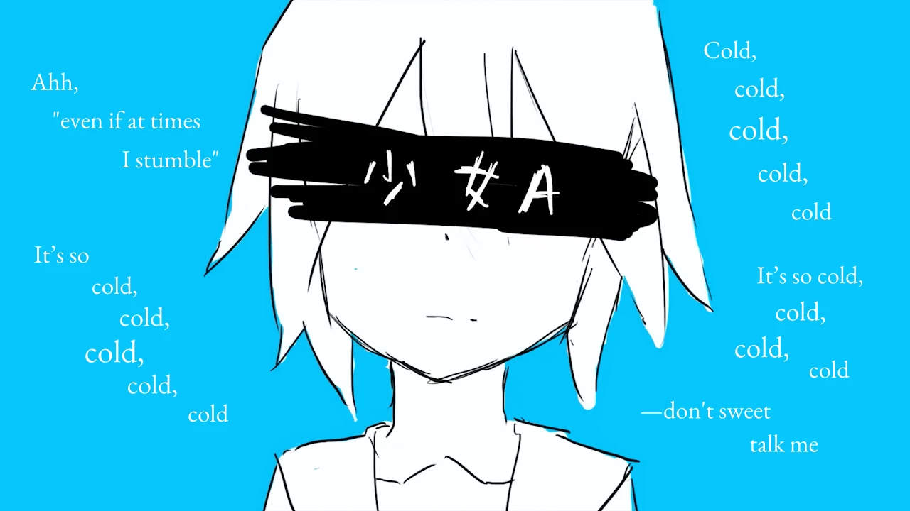

<h1 align='center'>siinamota - Young Girl A</h1>

<table align='center'>
    <tr>
        <td>  &nbsp https://youtu.be/AqI97zHMoQw </td>
        <td>  &nbsp https://nekocap.com/view/FFngb8MSx4 </td>
    </tr>
</table>

<table align='center'>
    <tr>
        <!-- Translation -->
        <td><b>Translation</b></td>
        <!--  Official TL via [Vocaloid Lyrics Wiki](https://vocaloidlyrics.miraheze.org/wiki/%E5%B0%91%E5%A5%B3A_(Shoujo_A)) -->
        <td>Official TL via <a href="https://vocaloidlyrics.miraheze.org/wiki/%E5%B0%91%E5%A5%B3A_(Shoujo_A)">Vocaloid Lyrics Wiki</a></td>
    </tr>
</table>

**Uploaded:** August 02, 2024  
**Last updated:** August 02, 2024

<!-- Description goes here -->
graphic design is my passion

## Folder info

| File | Description |
| ---- | ----------- |
[`young girl a.ass`](young%20girl%20a.ass) | Subtitle file |

## Font list

| Filename | Font name | NekoCap font? |
| ---- | ---- | :--: |
 [`EB-Garamond-Regular.ttf`](https://github.com/abrokecube/subtitles-fonts/tree/main/NekoCap%20fonts/EB-Garamond-Regular.ttf) | EB Garamond Regular | ✔️ |

<!-- Permissions -->
## 
You are free to use these subtitles for whatever purpose. Please retain any credits listed in the subs. Credit to me is not required, but is appreciated.
