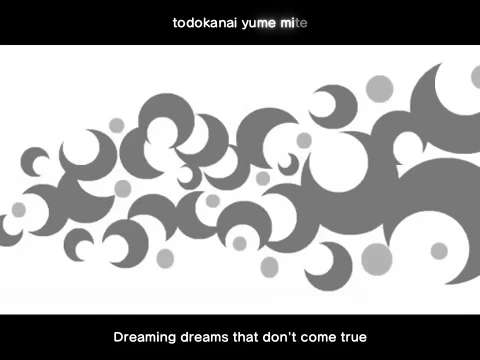

<h1 align='center'>wowaka - Rollin Girl ft. Hatsune Miku</h1>

<table align='center'>
    <tr>
        <td>  &nbsp https://youtu.be/vnw8zURAxkU </td>
        <td>  &nbsp https://nekocap.com/view/ft6mTAWZIm </td>
    </tr>
</table>

<table align='center'>
    <tr>
        <!-- Translation source -->
        <td><b>Translation source</b></td>
        <!--  Project DIVA F 2nd, with edits by MeaningfulUsername ([Vocaloid Lyrics Wiki](https://vocaloidlyrics.miraheze.org/wiki/%E3%83%AD%E3%83%BC%E3%83%AA%E3%83%B3%E3%82%AC%E3%83%BC%E3%83%AB_(Rolling_Girl))) -->
        <td>Project DIVA F 2nd, with edits by MeaningfulUsername (<a href="https://vocaloidlyrics.miraheze.org/wiki/%E3%83%AD%E3%83%BC%E3%83%AA%E3%83%B3%E3%82%AC%E3%83%BC%E3%83%AB_(Rolling_Girl)">Vocaloid Lyrics Wiki</a>)</td>
    </tr>
</table>

**Uploaded:** January 22, 2026  
**Last updated:** January 22, 2026

mmmm karaoke

## Folder info

| File | Description |
| ---- | ----------- |
[`rollin girl.ass`](rollin%20girl.ass) | Subtitle file |

## Font list

| Filename | Font name | NekoCap font? |
| ---- | ---- | :--: |
 [`FOT-SeuratPro-B.otf`](./fonts/FOT-SeuratPro-B.otf) | SeuratPro-B | ❌ |

<!-- Permissions -->
## 
You are free to use these subtitles for whatever purpose. Please retain any credits listed in the subs. Credit to me is not required, but is appreciated.
