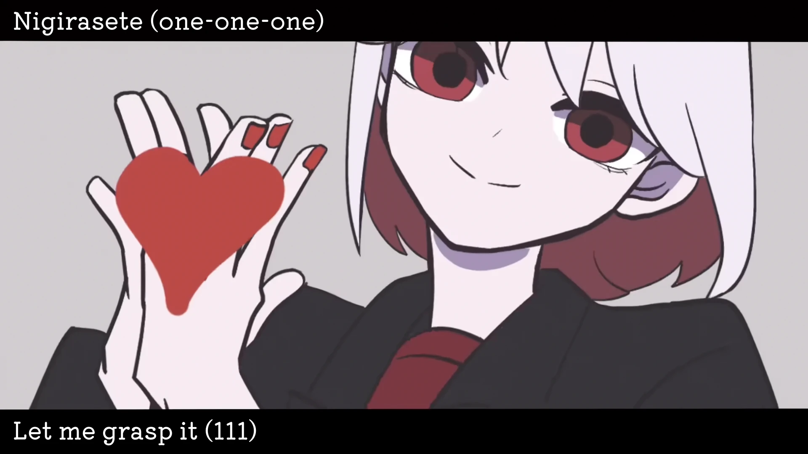

<h1 align='center'>yuri - Heart 111</h1>

<table align='center'>
    <tr>
        <td>  &nbsp https://youtu.be/g6IJyPUwwPM </td>
        <td>  &nbsp https://nekocap.com/view/O3GsuBmILE </td>
    </tr>
</table>

<table align='center'>
    <tr>
        <!-- Translation -->
        <td><b>Translation</b></td>
        <!--  Official (YouTube captions) -->
        <td>Official (YouTube captions)</td>
    </tr>
    <tr>
        <!-- Romanization -->
        <td><b>Romanization</b></td>
        <!--  [Genius Romanizations](https://genius.com/Genius-romanizations-yuri-111-heart-111-romanized-lyrics) -->
        <td><a href="https://genius.com/Genius-romanizations-yuri-111-heart-111-romanized-lyrics">Genius Romanizations</a></td>
    </tr>
</table>

**Uploaded:** September 25, 2024  
**Last updated:** September 25, 2024

<!-- Description goes here -->

## Folder info

| File | Description |
| ---- | ----------- |
[`heart111.ass`](heart111.ass) | Subtitle file |

## Font list

| Filename | Font name | NekoCap font? |
| ---- | ---- | :--: |
 [`赤明萌圆.ttf`](./fonts/%E8%B5%A4%E6%98%8E%E8%90%8C%E5%9C%86.ttf) | 赤明萌圆 Regular | ❌ |

<!-- Permissions -->
## 
You are free to use these subtitles for whatever purpose. Please keep any credits listed in the subs. Credit is not required, but is appreciated.
